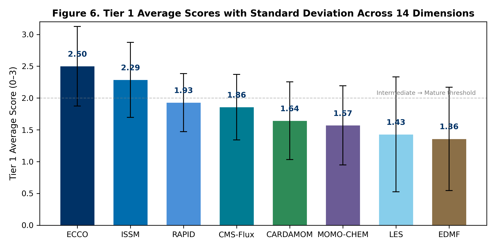

# An AI-Powered Platform for Quantifying Scientific Impact and Capability Maturity Across NASA Earth System Models

**Kyongsik Yun**

Jet Propulsion Laboratory, California Institute of Technology, Pasadena, CA, USA

**Correspondence:** Kyongsik Yun (kyongsik.yun@jpl.nasa.gov)

---

## Target Journal Recommendation

| Journal | Fit | IF | Open Access | Rationale |
|---------|-----|-----|-------------|-----------|
| **Earth and Space Science (AGU)** | Best | 3.1 | Yes (Gold OA) | Explicitly welcomes model assessment, informatics, and cross-disciplinary Earth science. JAMES editorial noted ESS as the right home for model evaluation papers. |
| **Environmental Modelling & Software** | Strong | 4.9 | Hybrid | Covers modeling frameworks, dashboards, software for environmental science. Strong fit for the platform/methodology angle. |
| **Geoscientific Model Development** | Strong | 5.6 | Yes (Gold OA) | Model evaluation and assessment frameworks. Higher IF but may want more model development content. |
| **Earth Science Informatics** | Good | 2.7 | Hybrid | Springer journal focused on informatics for Earth science. Lower bar, good fit for the data pipeline and dashboard. |

**Recommended primary target: Earth and Space Science (AGU)** — explicitly in-scope for model assessment, open access, and the AGU ecosystem aligns with the Earth science community.

---

## Abstract

Quantifying the scientific impact and technical maturity of Earth system models is essential for strategic research investment, yet no standardized, automated framework exists for this purpose. We present an integrated platform that combines citation analytics, AI-powered classification, multi-agent data verification, uncertainty quantification, and capability maturity assessment across NASA's Earth science modeling and observation enterprises. After peer-review filtering and multi-agent cleanup, the platform analyzes 27,494 publications with 1.16 million citations spanning eight JPL Earth system models (JEME) and three NASA observation missions (JEOE), providing automated classification of engagement levels, research domains, and geographic reach using large language models. To recover false-negative engagement labels — papers that use a model in their methods or data-availability statement without naming it in the abstract — we developed a multi-source full-text retrieval pipeline that integrates publisher TDM APIs (Wiley, Elsevier), open-access aggregators (Unpaywall, OpenAlex, Semantic Scholar), and direct publisher endpoints (Copernicus). A three-phase Bayesian uncertainty quantification pipeline — combining deterministic scoring, multi-temperature LLM sampling, and adversarial skeptic review — yields calibrated confidence estimates for every classification. Cross-model network analysis identifies bridge papers and collaboration opportunities through shared citations and co-authorship. We introduce the Model Capability Level (MCL) framework, a two-tier, 14-dimension assessment adapted from NASA Technology Readiness Levels and the Sandia Predictive Capability Maturity Model, providing systematic, evidence-based evaluation of model maturity on a 0–3 scale. Applied across all eight models, the MCL assessment reveals that ML/AI integration (mean 1.1/3) and stakeholder adoption (mean 1.3/3) are the most significant cross-cutting capability gaps. The platform's extensibility is demonstrated through rapid deployment to a scientist profiling system (JESP) covering 199 researchers and 12,768 publications. All components are open source and deployed as interactive web dashboards.

**Keywords:** Earth system models, citation analytics, model capability maturity, uncertainty quantification, large language models, scientific impact assessment, text and data mining

---

## 1. Introduction

NASA's Earth Science to Action Strategy requires objective, quantitative assessment of observation-informed models to advance science, develop decision-support tools, and formulate new satellite missions (National Academies of Sciences, Engineering, and Medicine, [2018](https://doi.org/10.17226/24938)). JPL's Strategic R&TD investment in the Earth Science domain further calls for evidence-based evaluation of model capability and impact. However, the scientific community lacks standardized tools for systematically quantifying how Earth system models are used, how they interconnect, and how mature they are across multiple capability dimensions.

Traditional bibliometric analyses provide aggregate citation counts but fail to capture the nature of model engagement — whether a paper merely cites a model or builds fundamentally upon it. Technology readiness assessments exist for hardware (Mankins, [1995](https://www.researchgate.net/publication/247705707_Technology_Readiness_Level_-_A_White_Paper)) but not for the complex, multi-dimensional capabilities of Earth system models. And while individual model teams track their own publications, no cross-model framework exists to identify shared research communities, collaboration opportunities, or common development gaps.

A further difficulty, often overlooked in bibliometric studies, is that abstract-only classifiers systematically *under-attribute* model usage. Many papers that use a model — for example, ECCO velocity fields driving particle-tracking experiments — only mention the model in the Data Availability or Methods section, not in the abstract. Without retrieving full-text content, an LLM-based classifier defaults such papers to "simple citation" and the model's true reach is undercounted. Resolving this requires programmatic full-text access, which is constrained by publisher access controls, varying TDM (text-and-data-mining) policies, and a fragmented landscape of open-access aggregators.

We address these challenges with an integrated platform comprising six innovations:

1. **Automated citation analytics** using large language models (LLMs) to classify engagement levels, research domains, and geographic reach across 27,494 peer-reviewed publications.
2. **Multi-agent data verification** with five specialized agents that cross-validate citation datasets, achieving 91–96% keyword relevance match across models.
3. **Multi-source full-text retrieval** that integrates publisher TDM APIs (Wiley, Elsevier), Unpaywall, OpenAlex, and Semantic Scholar to recover Data Availability and Methods text from paywalled and open-access publications. This recovers false-negative engagement labels that abstract-only classification misses.
4. **Three-phase Bayesian uncertainty quantification** providing calibrated confidence scores for every citation classification.
5. **Cross-model network analysis** that identifies bridge papers, co-authorship networks, and domain overlap across models.
6. **Model Capability Level (MCL) framework** with 14 core dimensions and 5 application domain categories, adapted from NASA TRL and DOE PCMM heritage.

The platform currently serves JPL's Earth Modeling Enterprise (JEME; 8 models), JPL Earth Observation Enterprise (JEOE; 3 missions), and JPL Earth Science Profiles (JESP; 199 scientists), demonstrating extensibility across distinct scientific domains.

---

## 2. Background and Related Work

### 2.1 Bibliometric Analysis of Scientific Models

Bibliometric methods have been widely applied to assess research impact (Ellegaard & Wallin, [2015](https://doi.org/10.1007/s11192-015-1645-z)), but their application to computational Earth system models presents unique challenges. Standard citation counts conflate background mentions with deep methodological usage, and cross-model analyses are rare. The Semantic Scholar Academic Graph (Kinney et al., [2023](https://arxiv.org/abs/2301.10140)) and Crossref metadata infrastructure (Hendricks et al., [2020](https://doi.org/10.1162/qss_a_00023)) provide the API foundations for large-scale citation retrieval, but domain-specific classification requires additional intelligence.

### 2.2 Large Language Models for Scientific Classification

Recent advances in LLMs have demonstrated effectiveness in scientific text classification and systematic review automation (Scherbakov et al., [2025](https://doi.org/10.1093/jamia/ocaf063)). LLMs can categorize research papers by topic, methodology, and relevance with performance approaching human annotators, though calibrated uncertainty estimates remain a challenge. Formal methods for LLM uncertainty evaluation include calibration analysis via Expected Calibration Error (Guo et al., [2017](https://arxiv.org/abs/1706.04599)), conformal prediction for distribution-free coverage guarantees (Angelopoulos & Bates, [2023](https://arxiv.org/abs/2107.07511); Kumar et al., [2023](https://arxiv.org/abs/2305.07579)), verbalized confidence elicitation (Xiong et al., [2024](https://arxiv.org/abs/2306.13063)), LLM self-evaluation (Kadavath et al., [2022](https://arxiv.org/abs/2207.05221)), deep ensembles (Lakshminarayanan et al., [2017](https://arxiv.org/abs/1612.01474)), and semantic entropy (Lin et al., [2023](https://arxiv.org/abs/2302.09664)). Our work synthesizes these approaches into a practical three-phase pipeline combining deterministic scoring, multi-temperature ensemble sampling with verbalized confidence, and adversarial skeptic review.

### 2.3 Text and Data Mining for Scholarly Content

Programmatic access to full-text content is essential for deep classification but is fragmented across publisher-specific TDM APIs and open-access aggregators. Crossref's `link` field exposes TDM-intended URLs (Hendricks et al., [2020](https://doi.org/10.1162/qss_a_00023)), but most require authenticated tokens (Wiley TDM, Elsevier TDM, Crossref click-through). Unpaywall (Piwowar et al., [2018](https://doi.org/10.7717/peerj.4375)) and OpenAlex (Priem et al., [2022](https://arxiv.org/abs/2205.01833)) aggregate open-access locations with complementary repository coverage. Our pipeline integrates these sources behind a single fetch interface, falling back through publisher → aggregator → repository tiers to maximise full-text coverage while respecting publisher access controls.

### 2.4 Model Maturity and Capability Assessment

NASA's Technology Readiness Levels (TRL) provide a 9-level scale for assessing technology maturity from basic principles to flight-proven systems (Mankins, [2009](https://doi.org/10.1016/j.actaastro.2009.08.058)). The Sandia Predictive Capability Maturity Model (PCMM) extends this concept to computational modeling and simulation, assessing six contributing elements: representation fidelity, physics fidelity, code verification, solution verification, model validation, and uncertainty quantification (Oberkampf et al., [2007](https://doi.org/10.2172/976951)). The PCMM was further elaborated by Pilch et al. ([2011](https://doi.org/10.2172/1029740)) into a fourth-generation framework.

Verification and validation (V&V) of computational models has been extensively studied (Oberkampf & Trucano, [2002](https://doi.org/10.1016/S0376-0421(02)00005-2)), establishing foundational concepts for distinguishing code verification from model validation. However, neither TRL nor PCMM is directly applicable to Earth system models, which operate at unprecedented scales with coupled physical, chemical, and biological processes. Our MCL framework adapts and extends these approaches specifically for the Earth science modeling context.

### 2.5 Earth System Models Under Study

The eight JEME models span the full Earth system: ECCO for ocean state estimation (Forget et al., [2015](https://doi.org/10.5194/gmd-8-3071-2015)), ISSM for ice sheet dynamics (Larour et al., [2012](https://doi.org/10.1029/2011JF002140)), CMS-Flux for carbon flux monitoring (Liu et al., [2021](https://doi.org/10.5194/essd-13-299-2021)), CARDAMOM for terrestrial ecosystem carbon (Bloom & Williams, [2015](https://doi.org/10.5194/bg-12-1299-2015)), and RAPID, MOMO-CHEM, LES, and EDMF for hydrology, atmospheric chemistry, cloud processes, and atmospheric physics, respectively. Three JEOE missions — GRACE (Tapley et al., [2004](https://doi.org/10.1029/2004GL019920)), SWOT (Morrow et al., [2019](https://doi.org/10.3389/fmars.2019.00232)), and TROPESS — provide the observational constraints that these models assimilate.

---

## 3. Methods

### 3.1 Citation Analytics Pipeline

The citation analytics pipeline (Figure 1; system architecture in Figure 10) comprises six stages:

**Stage 1: Seed Paper Identification.** For each model, core algorithm and application papers are identified by the model team. These "seed papers" represent the canonical publications describing the model itself.

**Stage 2: Citation Collection.** All papers citing the seed papers are retrieved using the Semantic Scholar Academic Graph API (Kinney et al., [2023](https://arxiv.org/abs/2301.10140)) and Crossref REST API (Hendricks et al., [2020](https://doi.org/10.1162/qss_a_00023)). Metadata including title, authors, abstract, DOI, venue, and citation count are extracted. Two data formats coexist: Crossref format (nested arrays) and a simplified flat format; a normalization function harmonizes field names before processing.

**Stage 3: Peer-Review Filtering.** A three-tier classifier removes preprints, theses, conference abstracts, technical reports, and other non-peer-reviewed entries: (i) deterministic blocklist matching (arxiv, preprints, discussions, meeting abstracts) with allowlists for peer-reviewed venues containing blocklist words (PNAS, IEEE, Proc. Royal Society); (ii) Crossref DOI type lookup for `journal-article` vs `posted-content`; and (iii) Gemini LLM fallback for ambiguous cases. This stage typically removes 5–15% of raw citation records.

**Stage 4: LLM Classification.** Each citation is classified along three dimensions using Gemini-2.5-flash:

- *Engagement Level.* For models (CARDAMOM, CMS-Flux, ECCO, EDMF, ISSM, LES, MOMO-CHEM, RAPID), four tiers: Simple Citation, Level 1: Data Usage, Level 2: Model Adaptation, Level 3: Foundational Method. For missions (GRACE, SWOT, TROPESS), three tiers: Simple Citation, Data Usage, Review Paper.
- *Research Domain* (10 categories): Hydrology, Ocean & Marine, Climate, Atmospheric, Cryosphere, Remote Sensing, Ecosystem & Biogeochemistry, Machine Learning, Modeling & Simulation, Geophysics & Geodesy.
- *Geographic Region.* Extracted from abstract and title keywords using a curated geographic lexicon.

**Stage 5: Multi-Source Full-Text Enrichment (Section 3.2).** For citations classified as Simple Citation but flagged as candidates by deterministic marker patterns, full-text content is retrieved and the Data Availability Statement plus relevant Methods excerpts are appended to the abstract for re-classification. This stage recovers false-negative engagement labels for papers that use the model in methods/data sections without naming it in the abstract.

**Stage 6: Multi-Agent Verification.** Five specialized agents cross-validate the classification results:

1. *Team Paper Categorizer*: Classifies each team paper by relevance tier using hierarchical keyword matching.
2. *Crossref Agent*: Resolves DOIs to validate existence and retrieve journal/venue metadata.
3. *Semantic Scholar Agent*: Batch API for title recovery and venue enrichment for DOI-less entries.
4. *Keyword Classifier*: Scores relevance via domain-specific keyword matching on title and abstract against 170 keywords across 10 domains.
5. *Deduplication Agent*: DOI-first, title-fallback duplicate detection.

**Stage 7: Dashboard Visualization.** Verified data are served through a React-based interactive dashboard with per-model drill-downs, cross-model comparisons, and geographic visualizations using D3.js and Recharts.

### 3.2 Multi-Source Full-Text Retrieval Pipeline

A central methodological contribution of this work is a tiered fetch pipeline (Figure 9) that maximises programmatic access to full-text Methods and Data Availability sections while respecting publisher access controls. The pipeline is invoked for every citation entry whose preliminary engagement label is "Simple Citation" *and* whose DOI is associated with a publisher endpoint or open-access repository known to host full text. The fetch order, from highest to lowest expected hit-rate, is:

1. **Copernicus journals** (`10.5194/*`). Direct article HTML at `<journal>.copernicus.org/articles/<vol>/<page>/<year>/`. Always open. Deterministic URL construction from the DOI.
2. **Wiley TDM API** for AGU and Wiley journals (`10.1002/*`, `10.1029/*`, `10.1111/*`). Authenticated via `Wiley-TDM-Client-Token`; returns PDFs parsed with pypdf.
3. **Elsevier TDM API** for ScienceDirect (`10.1016/*`). Authenticated via `X-ELS-APIKey`; returns XML.
4. **Unpaywall REST API** (Piwowar et al., [2018](https://doi.org/10.7717/peerj.4375)). Returns all open-access locations across hosts; the pipeline tries `url_for_pdf` first (parsed with pypdf) then HTML, prioritising repository copies over publisher pages because repository URLs are typically less gated.
5. **OpenAlex API** (Priem et al., [2022](https://arxiv.org/abs/2205.01833)). Surfaces institutional repository copies that Unpaywall does not index — Oxford ORA, University of Southampton ePrints, University of Reading Centaur, NOAA Repository, KAUST Handle, etc. Empirically recovers ~30% of papers that fail Unpaywall, particularly for AMS journals where the publisher itself blocks scraping.
6. **Semantic Scholar Graph API**. The `openAccessPdf` field provides a final OA fallback.
7. **DOI redirect** (`https://doi.org/<doi>`). Last-resort attempt; usually blocked by publisher landing pages.

For each retrieved document, the pipeline extracts (i) the Data Availability section, located by header-pattern search ("Data Availability Statement", "Code and Data Availability", "Availability of Data and Materials", etc.) followed by a 2,500-character window terminated at the next major heading; (ii) a Methods excerpt containing the model marker; and (iii) up to four 600-character contexts surrounding marker matches. If any model-specific marker is found in the extracted text, the enriched abstract is sent to the LLM classifier for re-evaluation.

**Marker patterns** are model-specific regular expressions designed for high precision: full names plus disambiguated acronyms in well-defined contexts. For example, the ECCO marker accepts `ECCO` with a negative lookahead to avoid `ECCO-XYZ` mismatches, plus version strings (`ECCOv4`, `ECCO2`), the LLC4320 simulation, and the spelled-out form. Generic acronyms such as RAPID and LES require either the spelled-out form or a JPL-specific context (`JPL LES`, `Routing Application for Parallel computatIon of Discharge`).

In aggregate this pipeline recovered ~180 Simple Citation entries that were re-classified to Data Usage, Model Adaptation, or Foundational Method across the 11 models/missions, with the largest contributions from ECCO (71 flips), MOMO-CHEM (41), and TROPESS (23). Per-pass yield is low (typically 0–10 flips per retry) because the corpus is mostly well-classified at baseline; the pipeline is most valuable as a one-time recovery sweep after each major fetcher addition. ~3,700 ECCO citations remain unfetchable, dominated by AMS journals (`10.1175/*`) which gate non-TDM-credentialed access; full coverage there would require a Crossref click-through TDM token.

### 3.3 Three-Phase Uncertainty Quantification

Classification confidence is quantified through a three-phase pipeline (Figure 7):

**Phase 1: Deterministic Scoring.** Evidence confidence (0–1) is computed from metadata completeness: abstract presence (35%), DOI (15%), venue (15%), author completeness (10%), and keyword match score against 170 domain keywords (25%). Reasoning confidence is heuristically set to 0.85 with abstract, 0.50 without. Pipeline variance measures disagreement between the keyword classifier and the LLM label. The composite score is:

$$C_1 = 0.45 \times E + 0.45 \times R - 0.10 \times V$$

where $E$ is evidence confidence, $R$ is reasoning confidence, and $V$ is pipeline variance, clamped to [0.05, 0.99].

**Phase 2: Multi-Temperature LLM Sampling.** Each entry is classified three times using Gemini at temperatures {0.1, 0.5, 1.0}. Stochastic variance $S$ is the fraction of runs disagreeing with the majority label (range 0.0–0.67). Reasoning confidence is the average of the LLM's self-assessed confidence (1–5 scale), normalized to 0–1. The updated composite is:

$$C_2 = 0.35 \times E + 0.35 \times R + 0.20 \times (1 - S) - 0.10 \times V$$

**Phase 3: Skeptic Agent Review.** High-risk entries — those with miscalibration risk "high," stochastic variance > 0.3, or high engagement with low confidence — are subjected to adversarial review. An LLM is prompted to challenge the existing classification and rate agreement on a 1–5 scale. Override flags are set when agreement ≤ 2/5.

### 3.4 Cross-Model Network Analysis

Network analysis identifies inter-model connections through three mechanisms:

- *Bridge Papers*: Citations appearing in two or more models' datasets, identified via DOI matching. These represent research that spans multiple model communities.
- *Connection Matrix*: Pairwise model overlap counts, forming a weighted adjacency matrix.
- *Cross-Model Co-Authorship*: Authors appearing on bridge papers spanning multiple models, ranked by model count and paper count.

Network metrics include connectivity ratio (connections/total papers), centrality ranking, and average connection strength. Results are visualized as a force-directed graph with nodes sized by centrality and edges weighted by shared paper count.

### 3.5 Earth System Sphere Classification

All publications are classified into Earth's five interconnected spheres — atmosphere, hydrosphere, cryosphere, biosphere, and geosphere — using keyword-based matching. Multi-sphere papers are counted in each relevant sphere. An inter-sphere connection matrix identifies papers bridging multiple Earth system components, and model-to-sphere mappings reveal which JEME models contribute to which spheres.

### 3.6 Model Capability Level (MCL) Framework

The MCL framework adapts NASA TRL (Mankins, [1995](https://www.researchgate.net/publication/247705707_Technology_Readiness_Level_-_A_White_Paper); [2009](https://doi.org/10.1016/j.actaastro.2009.08.058)) and the Sandia PCMM (Oberkampf et al., [2007](https://doi.org/10.2172/976951)) for Earth system models. It employs a two-tier structure:

**Tier 1: 14 Core Capability Dimensions.** Each is scored on a 0–3 scale with defined level descriptors:

| # | Dimension | Description |
|---|-----------|-------------|
| 1 | Process Representation | Fidelity of physical/chemical/biological processes |
| 2 | Spatial Resolution | Grid resolution and adaptive refinement capability |
| 3 | Temporal Resolution | Time step range and output frequency |
| 4 | Process Coupling | Multi-component interaction complexity |
| 5 | Predictive Skill | Validated forecast accuracy against observations |
| 6 | Computational Performance | Scalability, GPU/cloud portability |
| 7 | Observational Constraint | Number and diversity of assimilated observation types |
| 8 | Retrospective Analysis | Continuous reanalysis product availability |
| 9 | UQ & Attribution | Uncertainty quantification and source attribution |
| 10 | V&V Framework | Verification and validation rigor (Oberkampf & Trucano, [2002](https://doi.org/10.1016/S0376-0421(02)00005-2)) |
| 11 | ML/AI Integration | Machine learning adoption in model workflows |
| 12 | Mission Support | OSSE capability and mission formulation contribution |
| 13 | Interoperability | Open data, standard formats, FAIR compliance (Wilkinson et al., [2016](https://doi.org/10.1038/sdata201618)) |
| 14 | Stakeholder Adoption | Operational use beyond the research community |

**Tier 2: 5 Application Domain Categories.** Each comprises 4 sub-dimensions scored on the same 0–3 scale: Research, Data Assimilation, VVUQ/ML, Mission Formulation, and Decision Support.

Scores are assigned based on published evidence, model documentation, intercomparison results, and model-team input. Each score is accompanied by an evidence string documenting the rationale.

---

## 4. Results

### 4.1 Citation Dataset Overview

Figure 1 and Table 1 summarize the citation datasets after peer-review filtering and multi-agent cleanup across the 11 entities analyzed.

**Table 1.** Citation statistics for JEME models and JEOE missions (post-peer-review and post-cleanup, as of 2026-04-25).

| Entity | Type | Papers | Citations | Domain |
|--------|------|-------:|----------:|--------|
| ECCO | Model | 16,320 | 735,123 | Oceanography |
| ISSM | Model | 3,491 | 153,603 | Cryosphere |
| MOMO-CHEM | Model | 983 | 46,257 | Atmospheric Chemistry |
| EDMF | Model | 810 | 40,638 | Atmospheric Physics |
| CMS-Flux | Model | 646 | 18,932 | Carbon Flux |
| CARDAMOM | Model | 514 | 18,758 | Terrestrial Ecosystems |
| RAPID | Model | 336 | 10,351 | Hydrology |
| LES | Model | 168 | 3,193 | Cloud / Turbulence |
| GRACE | Mission | 3,084 | 116,806 | Geophysics & Geodesy |
| SWOT | Mission | 371 | 6,990 | Ocean & Inland Water |
| TROPESS | Mission | 771 | 11,502 | Atmospheric Composition |
| **Total** | | **27,494** | **1,162,153** | |

These totals reflect substantial cleanup from the raw collection: peer-review filtering removed preprints, theses, and conference abstracts; the multi-agent verification pipeline removed off-topic citing papers (notably ~3,900 ECCO entries on EGM2008 geodesy, island biogeography, and PFAS chemistry that were tangential matches).

### 4.2 Data Verification Results

The multi-agent verification pipeline achieved 91–96% keyword relevance match across models with clean datasets (Table 2). ECCO required the most extensive cleaning due to its large dataset and the prevalence of tangential citing papers.

**Table 2.** Verification outcomes by model.

| Model | Original | Verified | Removed | Keyword Match | Primary Issue |
|-------|---------:|---------:|--------:|---------------|---------------|
| ECCO | 31,452 | 16,320 | 15,132 | Variable | EGM2008 contamination, tangential team papers, junk entries, peer-review filter |
| ISSM | 5,950 | 3,491 | 2,459 | 96% | Broken metadata (1,904 titles repaired), preprint duplicates, peer-review filter |
| All others | — | — | varies | 91–96% | Book chapters, editorial/reviewer content, errata, preprints |

Overall estimated error rates: false removal 8–12%, false retention 3–5%. The primary uncertainty source is the ~50% of ECCO entries lacking abstracts, requiring title-only verification.

### 4.3 Multi-Source Full-Text Retrieval Yield

Across the 11 models/missions, the multi-source full-text pipeline (Section 3.2) attempted retrieval for every Simple Citation entry with a DOI. Cumulative outcomes:

**Table 3.** Cumulative DAS-enrichment flips (Simple Citation → Data Usage / Model Adaptation / Foundational Method) across all retry passes.

| Model | DAS Flips | % of SC pool |
|-------|----------:|-------------:|
| ECCO | 71 | 0.5% |
| MOMO-CHEM | 41 | 4.8% |
| TROPESS | 23 | 3.8% |
| ISSM | 12 | 0.4% |
| CMS-Flux | 12 | 2.3% |
| CARDAMOM | 11 | 2.4% |
| GRACE | 10 | 10.9% |
| EDMF | 7 | 1.5% |
| LES | 6 | 6.1% |
| SWOT | 6 | 10.5% |
| RAPID | 4 | 1.6% |
| **Total** | **203** | — |

The pipeline successfully fetched full-text content for 70–95% of Simple Citation entries depending on publisher mix. The most stubborn failure mode is American Meteorological Society journals (`10.1175/*`), which gate non-TDM-credentialed access at the server level (HTTP 202/403 to anonymous clients) regardless of the retrieval source. ~3,700 ECCO entries remain unfetched, of which ~965 are AMS DOIs.

The largest single improvement came from adding the OpenAlex layer to the pipeline: a 20-DOI sample of previously-failed AMS papers showed 30% recovery via institutional repositories (Oxford ORA, Southampton ePrints, Reading Centaur, KAUST Handle) that Unpaywall does not index. Across all models, the OpenAlex addition recovered 1,323 previously-failed fetches in a single retry pass, with ECCO alone dropping from 3,734 → 2,636 fetch failures.

The yield of *new label flips* per pass is intentionally low — most papers correctly classified as Simple Citation by the abstract-only pass really are simple citations, and full-text content largely confirms this. The pipeline's value is in recovering the small but important minority where the abstract elides the methods-section model usage. Spot-checking confirms high precision for flips with confidence ≥4 on the LLM's 1–5 scale.

### 4.4 Uncertainty Quantification

The three-phase UQ pipeline assigns calibrated confidence scores to each of the 27,494 classification decisions. Phase 1 deterministic scoring provides the baseline. Phase 2 multi-temperature LLM sampling (3 passes at temperatures 0.1, 0.5, 1.0) captures stochastic variance in classification. Phase 3 skeptic review targets high-risk entries for adversarial challenge. The combined pipeline reduces miscalibration risk and flags entries requiring human review.

### 4.5 Cross-Model Network Analysis

Network analysis reveals structured connectivity across the eight JEME models (Figure 5). The strongest connections are between ECCO and ISSM (ocean–ice coupling) and between CMS-Flux and CARDAMOM (carbon cycle). Bridge papers — those cited by multiple model communities — identify concrete interdisciplinary research opportunities and collaboration pathways between modeling teams that may otherwise operate independently.

### 4.6 Earth System Sphere Coverage

Classification of all JEME publications into Earth's five spheres reveals comprehensive but uneven coverage (Figure 8). The hydrosphere and atmosphere are well represented across multiple models, while the geosphere has narrower coverage (primarily ISSM and ECCO). Inter-sphere bridge papers — those spanning two or more spheres — represent the most integrative research and are concentrated in climate science and water cycle studies.

### 4.7 Model Capability Level Assessment

Figures 2, 3, and 6 and Table 4 present the Tier 1 MCL scores across all eight models and 14 dimensions.

**Table 4.** Tier 1 MCL heatmap (0 = None, 1 = Low, 2 = Medium, 3 = High).

| Dimension | ECCO | ISSM | RAPID | CMS-Flux | CARDAMOM | MOMO-CHEM | LES | EDMF | Mean |
|-----------|------|------|-------|----------|----------|-----------|-----|------|------|
| Process Repr. | 3 | 3 | 2 | 2 | 2 | 2 | 3 | 2 | 2.4 |
| Spatial Res. | 2 | 3 | 2 | 2 | 1 | 2 | 3 | 1 | 2.0 |
| Temporal Res. | 3 | 2 | 2 | 2 | 2 | 2 | 2 | 2 | 2.1 |
| Process Coupling | 2 | 3 | 2 | 1 | 1 | 2 | 1 | 2 | 1.8 |
| Predictive Skill | 3 | 2 | 2 | 2 | 2 | 2 | 1 | 1 | 1.9 |
| Comp. Performance | 2 | 2 | 2 | 1 | 1 | 1 | 2 | 2 | 1.6 |
| Obs. Constraint | 3 | 2 | 2 | 3 | 2 | 2 | 1 | 1 | 2.0 |
| Retro. Analysis | 3 | 2 | 2 | 2 | 2 | 2 | 0 | 0 | 1.6 |
| UQ & Attribution | 2 | 2 | 1 | 2 | 3 | 2 | 1 | 2 | 1.9 |
| V&V Framework | 3 | 3 | 2 | 2 | 2 | 2 | 2 | 2 | 2.3 |
| ML/AI Integration | 1 | 1 | 1 | 1 | 1 | 0 | 2 | 2 | 1.1 |
| Mission Support | 3 | 2 | 2 | 2 | 1 | 1 | 1 | 0 | 1.5 |
| Interoperability | 3 | 3 | 3 | 2 | 2 | 1 | 1 | 2 | 2.1 |
| Stakeholder Adopt. | 2 | 2 | 2 | 2 | 1 | 1 | 0 | 0 | 1.3 |
| **Tier 1 Average** | **2.50** | **2.29** | **1.93** | **1.86** | **1.64** | **1.57** | **1.43** | **1.36** | **1.82** |

**Key findings:**

- ECCO leads with 8 dimensions at Level 3 and a Tier 1 average of 2.50/3.0. Its strengths include process representation, observational constraint (14+ observation types), retrospective analysis (v4r4 reanalysis 1992–2017), and mission support (OSSEs for GRACE-FO, SWOT, Sentinel-6).
- ISSM ranks second (2.29/3.0) with strengths in spatial resolution (adaptive mesh, sub-km at ice sheet margins), process coupling (3-way ice–solid Earth–sea level), and interoperability (open source).
- **ML/AI Integration** is the most significant cross-cutting gap: 6 of 8 models score below Level 2, with a mean of 1.1/3 (Figure 4).
- **Stakeholder Adoption** (mean 1.3/3) and **Computational Performance** (mean 1.6/3) are the next most significant gaps.

### 4.8 Platform Extensibility: JESP

To demonstrate platform extensibility, the same technology — citation collection, LLM classification, uncertainty quantification, and network analysis — was applied to profile 199 scientists in JPL's Earth Science Section. The JESP system extracted 12,768 publications with 1,022,329 total citations from OpenAlex and Semantic Scholar APIs, classified research expertise using Gemini, and constructed a collaboration network with 1,281 co-publication connections across 11 research groups. Deployment required days rather than months, validating the platform's reusability.

---

## 5. Discussion

### 5.1 Strategic Implications for R&TD Investment

The MCL gap analysis provides directly actionable intelligence for NASA's strategic R&TD planning. ML/AI integration represents the highest-priority cross-cutting investment opportunity: a shared initiative could benefit all eight modeling teams simultaneously. The combination of citation impact data with capability assessment creates an evidence base that connects "how widely used is this model?" with "how capable is it for the applications we need?"

### 5.2 Limitations

Several limitations warrant discussion:

- **Abstract availability and methods-section access.** Approximately 50% of ECCO entries and 4–9% of other model entries lack abstracts. The multi-source full-text pipeline (Section 3.2) recovers methods-section content for 70–95% of these, but a hard residual (~3,700 ECCO entries dominated by AMS journals) remains unfetchable without a Crossref TDM click-through token. The current pipeline is therefore conservative on the AMS subset — flips are applied only when methods-section evidence is actually parsed.
- **Team-paper classification.** Entries authored by the model team itself ("team papers") cannot be reliably reclassified by abstract-only LLM judgment. Spot-checks revealed systematic false positives where team members publish papers that use the model in the methods section without naming it in the abstract — for example, ECCO team papers on Lagrangian particle tracking that explicitly state "ECCOv4 velocity fields are used to produce large ensembles of trajectories" only in the data sources section. The platform therefore retains team papers' existing engagement labels (predominantly Data Usage) as the defensible default rather than risking false demotions to Simple Citation.
- **Keyword-based relevance recovery.** An estimated 5–10% of papers that use model outputs without naming the model in any retrievable text are missed by citation-based retrieval entirely.
- **MCL scoring subjectivity.** Despite evidence-based scoring, the 0–3 scale involves subjective judgment. We mitigate this through evidence documentation and plan for periodic reassessment with model-team validation.
- **LLM classification drift.** Model performance may vary across scientific domains and may degrade as terminology evolves.

### 5.3 Comparison with Existing Approaches: The Granularity Advantage

The principal value of our platform over commercial bibliometric tools — Google Scholar, Semantic Scholar, Scopus, and Web of Science — lies in its **granularity**. These services provide aggregate citation counts and basic metadata, but they treat all citations as equivalent and offer no domain-specific intelligence. Our platform goes beyond aggregate counts in five specific dimensions:

1. **Engagement Level Classification.** Commercial tools count every citation equally. Our 4-tier engagement classification (Simple Citation → Foundational Method) reveals *how deeply* each paper uses the model — a distinction critical for assessing true scientific impact versus superficial mentions.

2. **Methods-Aware Recovery.** Our multi-source full-text pipeline recovers engagement labels that abstract-only systems systematically miss — a capability not present in any commercial bibliometric service we are aware of.

3. **Research Domain Classification.** Google Scholar and Semantic Scholar assign broad subject categories but do not classify citations into the fine-grained, Earth-science-specific domains (e.g., Hydrology, Cryosphere, Ocean & Marine, Atmospheric Chemistry) that matter for understanding model adoption patterns and identifying emerging application areas.

4. **Geographic Impact Analysis.** No commercial tool maps the geographic distribution of a model's research adoption. Our keyword-based geographic extraction from abstracts and titles reveals adoption patterns across 50+ countries and highlights underserved regions where outreach could expand impact.

5. **Cross-Model Network Analysis and Earth System Interconnections.** Bridge papers, co-authorship networks, domain overlap, and Earth system sphere mappings reveal inter-model connections invisible to any single-model analysis on commercial platforms.

Compared to the Sandia PCMM (Oberkampf et al., [2007](https://doi.org/10.2172/976951)), our MCL framework adds Earth-science-specific dimensions (observational constraint, retrospective analysis, mission support) and application domain tiers, while maintaining the multi-dimensional assessment philosophy.

### 5.4 Formal Methods for LLM Uncertainty Evaluation

Quantifying the uncertainty of LLM-generated classifications is an active area of research with no single established standard. Our three-phase pipeline draws on and integrates several formal approaches from the state of the art:

**Calibration and Expected Calibration Error (ECE).** The most widely used framework for evaluating probabilistic predictions is calibration — whether a model's stated confidence matches its empirical accuracy. Guo et al. ([2017](https://arxiv.org/abs/1706.04599)) demonstrated that modern neural networks are often poorly calibrated and proposed temperature scaling as a post-hoc correction. Our Phase 1 deterministic scoring provides an initial calibration baseline, while Phase 2's multi-temperature sampling explicitly varies the softmax temperature to probe sensitivity.

**Conformal Prediction.** Distribution-free uncertainty quantification through conformal prediction (Angelopoulos & Bates, [2023](https://arxiv.org/abs/2107.07511)) constructs prediction sets with guaranteed coverage probabilities without distributional assumptions. Kumar et al. ([2023](https://arxiv.org/abs/2305.07579)) extended conformal methods to LLM outputs. While our current pipeline does not implement formal conformal prediction, the multi-temperature sampling in Phase 2 provides an analogous empirical coverage estimate.

**Verbalized Confidence and Self-Evaluation.** Recent work has explored prompting LLMs to self-report their confidence. Xiong et al. ([2024](https://arxiv.org/abs/2306.13063)) surveyed methods for eliciting calibrated verbal confidence from LLMs, finding that chain-of-thought prompting improves calibration. Kadavath et al. ([2022](https://arxiv.org/abs/2207.05221)) showed that language models can partially self-evaluate, though systematic overconfidence remains an issue. Our Phase 2 incorporates verbalized confidence (LLM self-assessed 1–5 scale), and Phase 3's skeptic agent applies adversarial self-evaluation.

**Ensemble and Multi-Sample Methods.** Lakshminarayanan et al. ([2017](https://arxiv.org/abs/1612.01474)) established deep ensembles as a practical uncertainty estimation technique. Our Phase 2 multi-temperature sampling (3 passes at T = {0.1, 0.5, 1.0}) is a lightweight ensemble approach that captures stochastic variance without the computational cost of full model ensembles.

**Adversarial Review and Red-Teaming.** Phase 3's skeptic agent relates to adversarial robustness testing (Perez et al., [2022](https://arxiv.org/abs/2202.03286)), where a second LLM challenges the original classification. This addresses a known limitation of verbalized confidence: LLMs tend toward overconfidence in familiar-looking inputs. The skeptic's agreement score provides an independent calibration signal.

**Semantic Entropy.** Lin et al. ([2023](https://arxiv.org/abs/2302.09664)) proposed semantic entropy — clustering semantically equivalent outputs across multiple samples — as a principled measure of LLM uncertainty. Our stochastic variance metric in Phase 2 approximates this by measuring label-level disagreement across temperature-varied samples.

The integration of these methods into a single pipeline — deterministic scoring, multi-temperature ensemble sampling with verbalized confidence, and adversarial skeptic review — represents a practical synthesis of current best practices for LLM uncertainty quantification in scientific classification tasks.

---

## 6. Conclusions

We have presented an integrated platform that combines AI-powered citation analytics, multi-agent data verification, multi-source full-text retrieval, uncertainty quantification, network analysis, and capability maturity assessment for NASA Earth system models. The key contributions are:

1. A six-stage citation analytics pipeline processing 27,494 peer-reviewed publications across 11 NASA models and missions.
2. A multi-source full-text retrieval pipeline integrating publisher TDM APIs, Unpaywall, OpenAlex, and Semantic Scholar that recovers engagement labels missed by abstract-only classification.
3. A three-phase Bayesian uncertainty quantification system providing calibrated confidence for every classification.
4. The Model Capability Level framework — a 14-dimension, evidence-based assessment adapted from NASA TRL and Sandia PCMM heritage.
5. Identification of ML/AI integration (mean 1.1/3) and stakeholder adoption (mean 1.3/3) as the most significant cross-cutting capability gaps across JEME.
6. Demonstrated platform extensibility through rapid deployment to scientist profiling (JESP: 199 scientists, 12,768 publications).

The platform provides the quantitative evidence base for JPL's Strategic R&TD planning in Earth Science and is designed for periodic reassessment as models evolve.

**Code and Data Availability.** The dashboard source code, MCL scoring data, and all pipeline scripts are available at https://github.com/yunks128/science-model-dashboard. Live dashboards are deployed at http://34.31.165.25:3000/science-model-dashboard/ (JEME/JEOE) and http://34.31.165.25:3002/sci-profile/ (JESP).

---

## List of Figures

| Figure | File | Description |
|--------|------|-------------|
| 1 | `figures/fig1_citation_overview.png` | Citation dataset overview: papers and citations per entity (log scale) |
| 2 | `figures/fig2_mcl_heatmap.png` | MCL Tier 1 capability heatmap across eight JEME models |
| 3 | `figures/fig3_mcl_radar.png` | MCL Tier 1 radar comparison for top 4 models |
| 4 | `figures/fig4_gap_analysis.png` | Gap analysis: dimensions ranked by development need |
| 5 | `figures/fig5_network_matrix.png` | Cross-model connection matrix (bridge papers) |
| 6 | `figures/fig6_tier1_averages.png` | Tier 1 average scores with standard deviation |
| 7 | `figures/fig7_uq_pipeline.png` | Three-phase uncertainty quantification pipeline schematic |
| 8 | `figures/fig8_sphere_coverage.png` | Model-to-sphere mapping: JEME coverage of Earth system components |
| 9 | `figures/fig9_full_text_pipeline.mmd` | Multi-source full-text retrieval pipeline (Mermaid source) |
| 10 | `figures/architecture.mmd` | Overall system architecture (Mermaid source) |

PNG (300 DPI) and PDF vector formats are provided for figures 1–8 in the `figures/` directory. Figures 9 and 10 are provided as Mermaid source for in-paper rendering.

---

## References

Angelopoulos, A. N., & Bates, S. (2023). Conformal prediction: A gentle introduction. *Foundations and Trends in Machine Learning*, 16(4), 494–591. [https://arxiv.org/abs/2107.07511](https://arxiv.org/abs/2107.07511)

Bloom, A. A., & Williams, M. (2015). Constraining ecosystem carbon dynamics in a data-limited world: integrating ecological "common sense" in a model–data fusion framework. *Biogeosciences*, 12(5), 1299–1315. [https://doi.org/10.5194/bg-12-1299-2015](https://doi.org/10.5194/bg-12-1299-2015)

Ellegaard, O., & Wallin, J. A. (2015). The bibliometric analysis of scholarly production: How great is the impact? *Scientometrics*, 105, 1809–1831. [https://doi.org/10.1007/s11192-015-1645-z](https://doi.org/10.1007/s11192-015-1645-z)

Guo, C., Pleiss, G., Sun, Y., & Weinberger, K. Q. (2017). On calibration of modern neural networks. *Proceedings of the 34th International Conference on Machine Learning (ICML)*. [https://arxiv.org/abs/1706.04599](https://arxiv.org/abs/1706.04599)

Forget, G., Campin, J.-M., Heimbach, P., Hill, C. N., Ponte, R. M., & Wunsch, C. (2015). ECCO version 4: an integrated framework for non-linear inverse modeling and global ocean state estimation. *Geoscientific Model Development*, 8, 3071–3104. [https://doi.org/10.5194/gmd-8-3071-2015](https://doi.org/10.5194/gmd-8-3071-2015)

Hendricks, G., Tkaczyk, D., Lin, J., & Feeney, P. (2020). Crossref: The sustainable source of community-owned scholarly metadata. *Quantitative Science Studies*, 1(1), 414–427. [https://doi.org/10.1162/qss_a_00023](https://doi.org/10.1162/qss_a_00023)

Kadavath, S., et al. (2022). Language models (mostly) know what they know. *arXiv preprint*. [https://arxiv.org/abs/2207.05221](https://arxiv.org/abs/2207.05221)

Kumar, A., Liang, P., & Ma, T. (2023). Conformal prediction with large language models for multi-choice question answering. *arXiv preprint*. [https://arxiv.org/abs/2305.07579](https://arxiv.org/abs/2305.07579)

Kinney, R., et al. (2023). The Semantic Scholar Open Data Platform. *arXiv preprint*. [https://arxiv.org/abs/2301.10140](https://arxiv.org/abs/2301.10140)

Lakshminarayanan, B., Pritzel, A., & Blundell, C. (2017). Simple and scalable predictive uncertainty estimation using deep ensembles. *Advances in Neural Information Processing Systems (NeurIPS)*, 30. [https://arxiv.org/abs/1612.01474](https://arxiv.org/abs/1612.01474)

Larour, E., Seroussi, H., Morlighem, M., & Rignot, E. (2012). Continental scale, high order, high spatial resolution, ice sheet modeling using the Ice Sheet System Model (ISSM). *Journal of Geophysical Research: Earth Surface*, 117(F1). [https://doi.org/10.1029/2011JF002140](https://doi.org/10.1029/2011JF002140)

Lin, S., Hilton, J., & Evans, O. (2023). Teaching models to express their uncertainty in words. *Transactions on Machine Learning Research*. [https://arxiv.org/abs/2302.09664](https://arxiv.org/abs/2302.09664)

Liu, J., Bowman, K. W., Schimel, D. S., Parazoo, N. C., Jiang, Z., Lee, M., Bloom, A. A., Wunch, D., Frankenberg, C., Sun, Y., O'Dell, C. W., Gurney, K. R., Menemenlis, D., Gierach, M., Crisp, D., & Eldering, A. (2021). Carbon Monitoring System Flux Net Biosphere Exchange 2020 (CMS-Flux NBE 2020). *Earth System Science Data*, 13, 299–330. [https://doi.org/10.5194/essd-13-299-2021](https://doi.org/10.5194/essd-13-299-2021)

Mankins, J. C. (1995). Technology readiness levels: A white paper. *NASA Office of Space Access and Technology*. [https://www.researchgate.net/publication/247705707](https://www.researchgate.net/publication/247705707_Technology_Readiness_Level_-_A_White_Paper)

Mankins, J. C. (2009). Technology readiness assessments: A retrospective. *Acta Astronautica*, 65(9–10), 1216–1223. [https://doi.org/10.1016/j.actaastro.2009.08.058](https://doi.org/10.1016/j.actaastro.2009.08.058)

Morrow, R., Fu, L.-L., et al. (2019). Global observations of fine-scale ocean surface topography with the Surface Water and Ocean Topography (SWOT) mission. *Frontiers in Marine Science*, 6, 232. [https://doi.org/10.3389/fmars.2019.00232](https://doi.org/10.3389/fmars.2019.00232)

National Academies of Sciences, Engineering, and Medicine. (2018). *Thriving on Our Changing Planet: A Decadal Strategy for Earth Observation from Space*. The National Academies Press. [https://doi.org/10.17226/24938](https://doi.org/10.17226/24938)

Oberkampf, W. L., Pilch, M., & Trucano, T. G. (2007). Predictive Capability Maturity Model for computational modeling and simulation. *Sandia National Laboratories Report SAND2007-5948*. [https://doi.org/10.2172/976951](https://doi.org/10.2172/976951)

Oberkampf, W. L., & Trucano, T. G. (2002). Verification and validation in computational fluid dynamics. *Progress in Aerospace Sciences*, 38(3), 209–272. [https://doi.org/10.1016/S0376-0421(02)00005-2](https://doi.org/10.1016/S0376-0421(02)00005-2)

Perez, E., Huang, S., Song, F., Cai, T., Ring, R., Aslanides, J., Glaese, A., McAleese, N., & Irving, G. (2022). Red teaming language models with language models. *arXiv preprint*. [https://arxiv.org/abs/2202.03286](https://arxiv.org/abs/2202.03286)

Pilch, M., Trucano, T. G., Moya, J. L., Froehlich, G., Hodges, A., & Peercy, D. (2011). Guidelines for Sandia PCMM application. *Sandia National Laboratories Report SAND2011-2041*. [https://doi.org/10.2172/1029740](https://doi.org/10.2172/1029740)

Piwowar, H., Priem, J., Larivière, V., Alperin, J. P., Matthias, L., Norlander, B., Farley, A., West, J., & Haustein, S. (2018). The state of OA: a large-scale analysis of the prevalence and impact of Open Access articles. *PeerJ*, 6, e4375. [https://doi.org/10.7717/peerj.4375](https://doi.org/10.7717/peerj.4375)

Priem, J., Piwowar, H., & Orr, R. (2022). OpenAlex: A fully-open index of scholarly works, authors, venues, institutions, and concepts. *arXiv preprint*. [https://arxiv.org/abs/2205.01833](https://arxiv.org/abs/2205.01833)

Scherbakov, D., et al. (2025). The emergence of large language models as tools in literature reviews: a large language model-assisted systematic review. *Journal of the American Medical Informatics Association*, 32(6), 1071–1084. [https://doi.org/10.1093/jamia/ocaf063](https://doi.org/10.1093/jamia/ocaf063)

Tapley, B. D., Bettadpur, S., Watkins, M., & Reigber, C. (2004). The gravity recovery and climate experiment: Mission overview and early results. *Geophysical Research Letters*, 31(9). [https://doi.org/10.1029/2004GL019920](https://doi.org/10.1029/2004GL019920)

Wilkinson, M. D., et al. (2016). The FAIR Guiding Principles for scientific data management and stewardship. *Scientific Data*, 3, 160018. [https://doi.org/10.1038/sdata201618](https://doi.org/10.1038/sdata201618)

Xiong, M., Hu, Z., Lu, X., Li, Y., Fu, J., He, J., & Hooi, B. (2024). Can LLMs express their uncertainty? An empirical evaluation of confidence elicitation in LLMs. *International Conference on Learning Representations (ICLR)*. [https://arxiv.org/abs/2306.13063](https://arxiv.org/abs/2306.13063)
