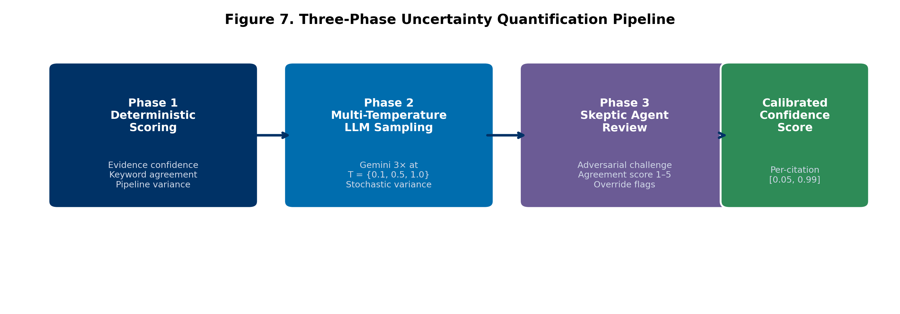
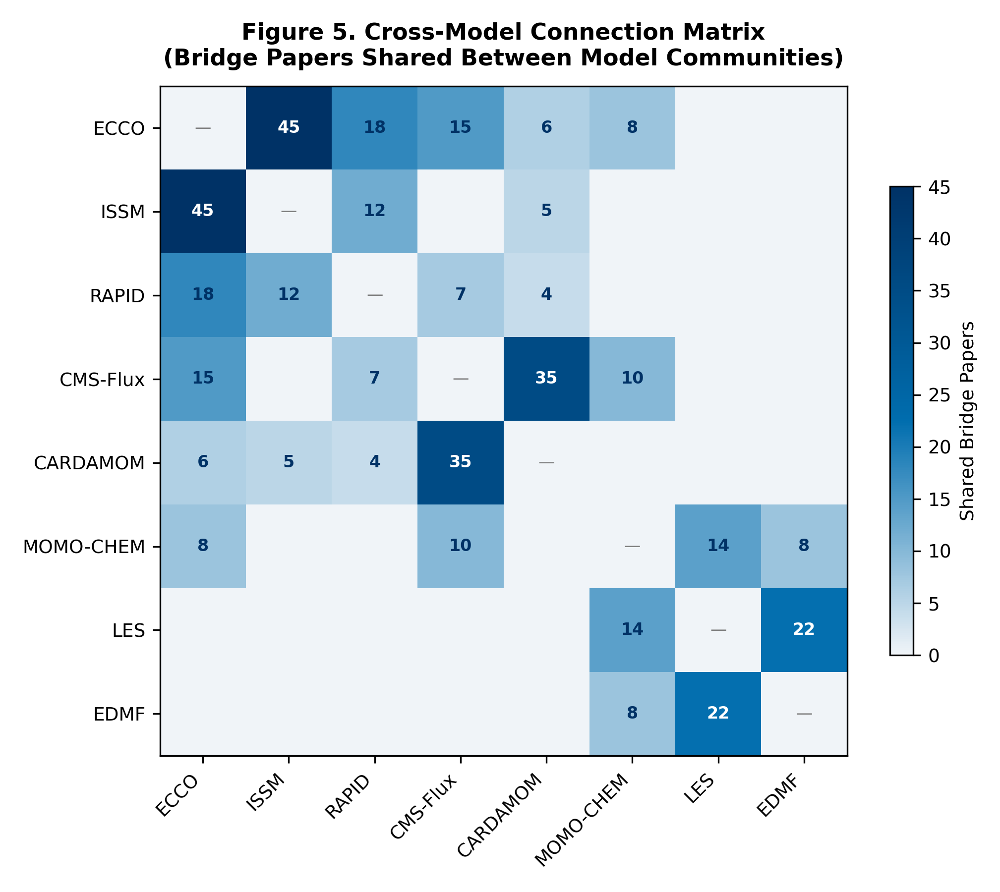
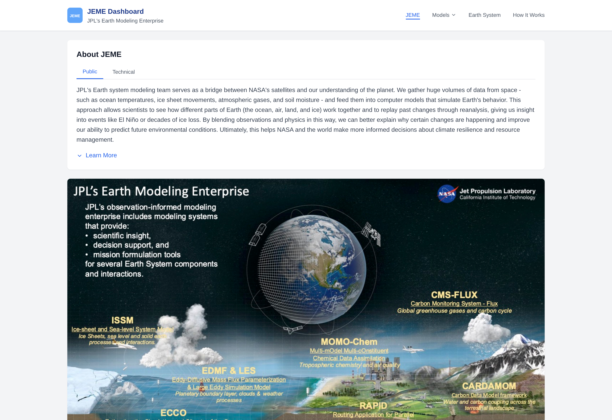
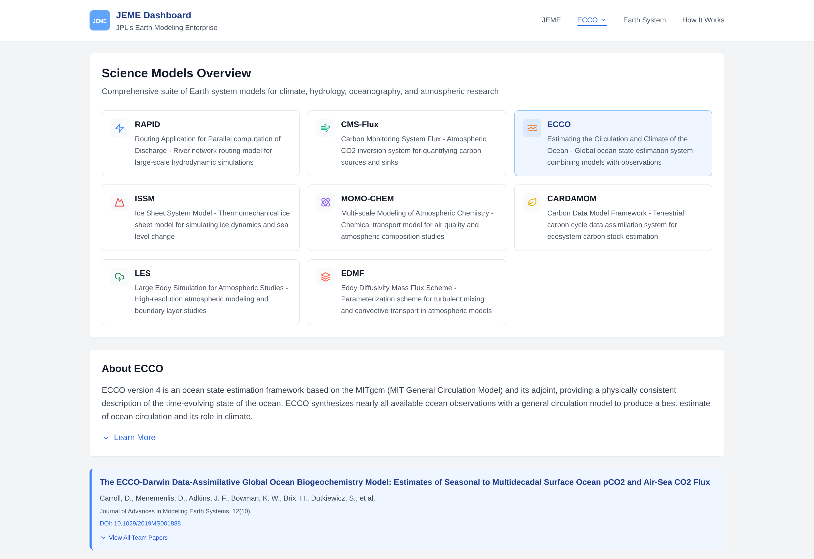
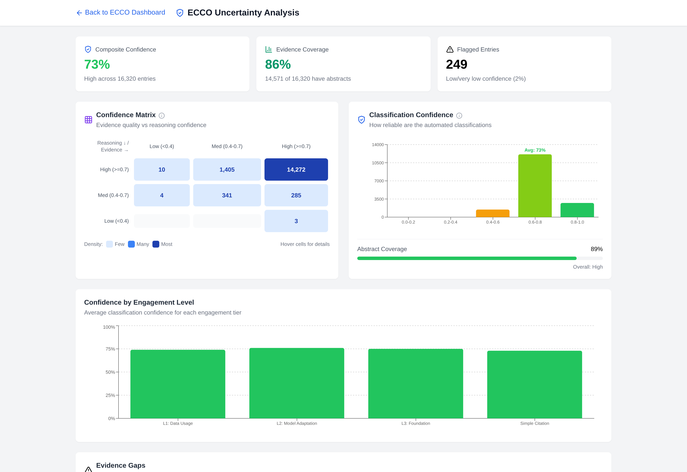
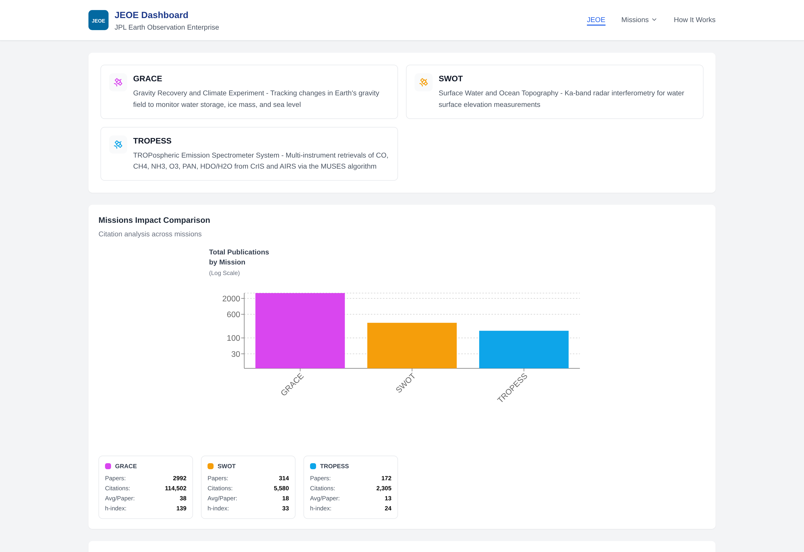
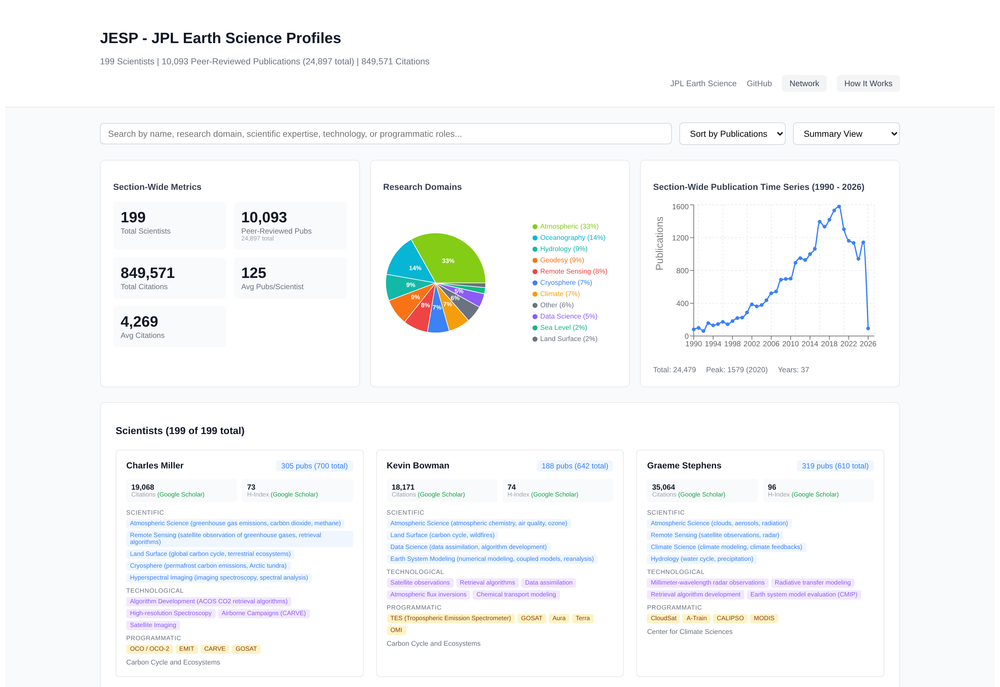

# An AI-Powered Platform for Quantifying Scientific Impact Across NASA Earth System Models

**Kyongsik Yun**

Jet Propulsion Laboratory, California Institute of Technology, Pasadena, CA, USA

**Correspondence:** Kyongsik Yun (kyongsik.yun@jpl.nasa.gov)

## Target Journal Recommendation

The recommended primary target is *Earth and Space Science* (AGU, IF 3.1, gold open access). The journal explicitly welcomes model assessment, informatics, and cross-disciplinary Earth science work, and the AGU ecosystem aligns with the Earth science community served by this platform. *Environmental Modelling & Software* (IF 4.9) and *Geoscientific Model Development* (IF 5.6) are alternative strong fits, the former for the platform/methodology angle and the latter for model evaluation; *Earth Science Informatics* (Springer, IF 2.7) provides a lower-bar alternative aimed at data pipelines and dashboards.

## Abstract

Quantifying the scientific impact of Earth system models is essential for strategic research investment, yet no standardized, automated framework exists for this purpose. We present an integrated platform that combines citation analytics, AI-powered classification, multi-agent data verification, and uncertainty quantification across NASA's Earth science modeling and observation enterprises. After peer-review filtering and multi-agent cleanup, the platform analyzes 27,494 publications with 1.16 million citations spanning eight JPL Earth system models (JEME) and three NASA observation missions (JEOE), providing automated classification of engagement levels, research domains, and geographic reach using large language models. To recover false-negative engagement labels — papers that use a model in their methods or data-availability statement without naming it in the abstract — we developed a multi-source full-text retrieval pipeline that integrates publisher text-and-data-mining APIs (Wiley, Elsevier), open-access aggregators (Unpaywall, OpenAlex, Semantic Scholar), and direct publisher endpoints (Copernicus). A three-phase Bayesian uncertainty quantification pipeline combining deterministic scoring, multi-temperature LLM sampling, and adversarial skeptic review yields calibrated confidence estimates for every classification. Cross-model network analysis identifies bridge papers and collaboration opportunities through shared citations and co-authorship. The platform's extensibility is demonstrated through rapid deployment to a scientist profiling system covering 199 researchers and 12,768 publications. All components are open source and deployed as interactive web dashboards.

**Keywords:** Earth system models, citation analytics, uncertainty quantification, large language models, scientific impact assessment, text and data mining

## 1. Introduction

NASA's Earth Science to Action Strategy requires objective, quantitative assessment of observation-informed models to advance science, develop decision-support tools, and formulate new satellite missions (National Academies of Sciences, Engineering, and Medicine, 2018). JPL's Strategic R&TD investment in the Earth Science domain further calls for evidence-based evaluation of model capability and impact. However, the scientific community lacks standardized tools for systematically quantifying how Earth system models are used and how they interconnect.

Traditional bibliometric analyses provide aggregate citation counts but fail to capture the nature of model engagement — whether a paper merely cites a model or builds fundamentally upon it. While individual model teams track their own publications, no cross-model framework exists to identify shared research communities, collaboration opportunities, or common development gaps.

A further difficulty, often overlooked in bibliometric studies, is that abstract-only classifiers systematically under-attribute model usage. Many papers that use a model — for example, ECCO velocity fields driving particle-tracking experiments — only mention the model in the Data Availability or Methods section, not in the abstract. Without retrieving full-text content, an LLM-based classifier defaults such papers to "simple citation" and the model's true reach is undercounted. Resolving this requires programmatic full-text access, which is constrained by publisher access controls, varying text-and-data-mining policies, and a fragmented landscape of open-access aggregators.

We address these challenges with an integrated platform comprising five contributions. First, automated citation analytics use large language models to classify engagement levels, research domains, and geographic reach across 27,494 peer-reviewed publications. Second, multi-agent data verification with five specialized agents cross-validates citation datasets, achieving 91–96% keyword relevance match across models. Third, a multi-source full-text retrieval pipeline integrates publisher text-and-data-mining APIs (Wiley, Elsevier), Unpaywall, OpenAlex, and Semantic Scholar to recover Data Availability and Methods text from paywalled and open-access publications, recovering false-negative engagement labels that abstract-only classification misses. Fourth, a three-phase Bayesian uncertainty quantification pipeline provides calibrated confidence scores for every citation classification. Fifth, cross-model network analysis identifies bridge papers, co-authorship networks, and domain overlap across models. The platform currently serves JPL's Earth Modeling Enterprise (eight models), JPL Earth Observation Enterprise (three missions), and JPL Earth Science Profiles (199 scientists), demonstrating extensibility across distinct scientific domains.

## 2. Background and Related Work

### 2.1 Bibliometric Analysis of Scientific Models

Bibliometric methods have been widely applied to assess research impact (Ellegaard & Wallin, 2015), but their application to computational Earth system models presents unique challenges. Standard citation counts conflate background mentions with deep methodological usage, and cross-model analyses are rare. The Semantic Scholar Academic Graph (Kinney et al., 2023) and Crossref metadata infrastructure (Hendricks et al., 2020) provide the API foundations for large-scale citation retrieval, but domain-specific classification requires additional intelligence.

### 2.2 Large Language Models for Scientific Classification

Recent advances in LLMs have demonstrated effectiveness in scientific text classification and systematic review automation (Scherbakov et al., 2025). LLMs can categorize research papers by topic, methodology, and relevance with performance approaching human annotators, though calibrated uncertainty estimates remain a challenge. Formal methods for LLM uncertainty evaluation include calibration analysis via expected calibration error (Guo et al., 2017), conformal prediction for distribution-free coverage guarantees (Angelopoulos & Bates, 2023; Kumar et al., 2023), verbalized confidence elicitation (Xiong et al., 2024), LLM self-evaluation (Kadavath et al., 2022), deep ensembles (Lakshminarayanan et al., 2017), and semantic entropy (Lin et al., 2023). Our work synthesizes these approaches into a practical pipeline combining deterministic scoring, multi-temperature ensemble sampling with verbalized confidence, and adversarial skeptic review.

### 2.3 Text and Data Mining for Scholarly Content

Programmatic access to full-text content is essential for deep classification but is fragmented across publisher-specific text-and-data-mining APIs and open-access aggregators. Crossref's `link` field exposes mining-intended URLs (Hendricks et al., 2020), but most require authenticated tokens (Wiley, Elsevier, Crossref click-through). Unpaywall (Piwowar et al., 2018) and OpenAlex (Priem et al., 2022) aggregate open-access locations with complementary repository coverage. Our pipeline integrates these sources behind a single fetch interface, falling back through publisher, aggregator, and repository tiers to maximise full-text coverage while respecting publisher access controls.

### 2.4 Earth System Models Under Study

The eight JEME models span the full Earth system: ECCO for ocean state estimation (Forget et al., 2015), ISSM for ice sheet dynamics (Larour et al., 2012), CMS-Flux for carbon flux monitoring (Liu et al., 2021), CARDAMOM for terrestrial ecosystem carbon (Bloom & Williams, 2015), and RAPID, MOMO-CHEM, LES, and EDMF for hydrology, atmospheric chemistry, cloud processes, and atmospheric physics, respectively. Three JEOE missions — GRACE (Tapley et al., 2004), SWOT (Morrow et al., 2019), and TROPESS — provide the observational constraints that these models assimilate.

## 3. Methods

### 3.1 Citation Analytics Pipeline

The citation analytics pipeline is summarised in Figure 1; the overall system architecture appears in Figure 10. For each model, core algorithm and application papers are identified by the model team as canonical "seed papers" describing the model itself. All papers citing the seed papers are then retrieved using the Semantic Scholar Academic Graph API (Kinney et al., 2023) and Crossref REST API (Hendricks et al., 2020), with title, authors, abstract, DOI, venue, and citation count extracted. Two data formats coexist (Crossref nested arrays and a simplified flat format) and a normalization function harmonises field names before processing.

A three-tier classifier then removes preprints, theses, conference abstracts, technical reports, and other non-peer-reviewed entries. Deterministic blocklist matching catches arxiv, preprints, discussions, and meeting abstracts, with allowlists for peer-reviewed venues that contain blocklist words (PNAS, IEEE, Proc. Royal Society). A Crossref DOI-type lookup distinguishes `journal-article` from `posted-content` and similar types. Ambiguous cases are resolved by a Gemini LLM fallback. This filter typically removes 5–15% of raw citation records.

Each remaining citation is classified along three dimensions using Gemini-2.5-flash. For models (CARDAMOM, CMS-Flux, ECCO, EDMF, ISSM, LES, MOMO-CHEM, RAPID), four engagement tiers are recognised: Simple Citation, Level 1: Data Usage, Level 2: Model Adaptation, and Level 3: Foundational Method. For missions (GRACE, SWOT, TROPESS), three tiers are used: Simple Citation, Data Usage, and Review Paper. A research-domain classifier assigns one of ten categories — Hydrology, Ocean & Marine, Climate, Atmospheric, Cryosphere, Remote Sensing, Ecosystem & Biogeochemistry, Machine Learning, Modeling & Simulation, Geophysics & Geodesy. Geographic regions are extracted from abstract and title keywords using a curated lexicon.

Citations classified as Simple Citation but flagged as candidates by deterministic marker patterns then enter the multi-source full-text enrichment pipeline (Section 3.2). Full-text content is retrieved and the Data Availability Statement plus relevant Methods excerpts are appended to the abstract for re-classification, recovering false-negative engagement labels for papers that use the model in methods or data sections without naming it in the abstract.

Five specialised agents then cross-validate the classification results. A team paper categorizer classifies each team paper by relevance tier using hierarchical keyword matching. A Crossref agent resolves DOIs to validate existence and retrieve journal/venue metadata. A Semantic Scholar agent uses the batch API for title recovery and venue enrichment for DOI-less entries. A keyword classifier scores relevance via domain-specific keyword matching on title and abstract against 170 keywords across 10 domains. A deduplication agent applies DOI-first, title-fallback duplicate detection. Verified data are finally served through a React-based interactive dashboard with per-model drill-downs, cross-model comparisons, and geographic visualisations using D3.js and Recharts.

### 3.2 Multi-Source Full-Text Retrieval Pipeline

A central methodological contribution of this work is a tiered fetch pipeline (Figure 9) that maximises programmatic access to full-text Methods and Data Availability sections while respecting publisher access controls. The pipeline is invoked for every citation entry whose preliminary engagement label is "Simple Citation" and whose DOI is associated with a publisher endpoint or open-access repository known to host full text.

The fetch order, from highest to lowest expected hit-rate, begins with Copernicus journals (`10.5194/*`), where the article HTML is constructed deterministically from the DOI at `<journal>.copernicus.org/articles/<vol>/<page>/<year>/` and is always open. For AGU and Wiley journals (`10.1002/*`, `10.1029/*`, `10.1111/*`), the pipeline calls the Wiley TDM API authenticated via a `Wiley-TDM-Client-Token` header; the API returns PDFs that are parsed with pypdf. For ScienceDirect (`10.1016/*`), the Elsevier TDM API authenticated via `X-ELS-APIKey` returns XML.

If publisher-direct routes do not apply or fail, the pipeline queries the Unpaywall REST API (Piwowar et al., 2018), which returns all open-access locations across hosts. Each location's `url_for_pdf` is tried first (parsed with pypdf), then HTML, prioritising repository copies over publisher pages because repository URLs are typically less gated. When Unpaywall yields nothing, the OpenAlex API (Priem et al., 2022) surfaces institutional repository copies that Unpaywall does not index — Oxford ORA, University of Southampton ePrints, University of Reading Centaur, NOAA Repository, and KAUST Handle, among others. Empirically OpenAlex recovers about 30% of papers that fail Unpaywall, particularly for AMS journals where the publisher itself blocks scraping. As a final open-access fallback, the Semantic Scholar Graph API exposes an `openAccessPdf` field. A last-resort DOI redirect (`https://doi.org/<doi>`) usually fails because publisher landing pages block automated agents.

For each retrieved document, the pipeline extracts the Data Availability section by header-pattern search ("Data Availability Statement", "Code and Data Availability", "Availability of Data and Materials") followed by a 2,500-character window terminated at the next major heading. It also extracts a Methods excerpt containing the model marker, plus up to four 600-character contexts surrounding marker matches. If any model-specific marker is found in the extracted text, the enriched abstract is sent back to the LLM classifier for re-evaluation.

Marker patterns are model-specific regular expressions designed for high precision: full names plus disambiguated acronyms in well-defined contexts. The ECCO marker, for example, accepts `ECCO` with a negative lookahead to avoid `ECCO-XYZ` mismatches, plus version strings such as `ECCOv4` or `ECCO2`, the LLC4320 simulation, and the spelled-out form. Generic acronyms such as RAPID and LES require either the spelled-out form or a JPL-specific context (`JPL LES`, `Routing Application for Parallel computatIon of Discharge`).

In aggregate this pipeline recovered approximately 180 Simple Citation entries that were re-classified to Data Usage, Model Adaptation, or Foundational Method across the 11 models and missions, with the largest contributions from ECCO (71 flips), MOMO-CHEM (41), and TROPESS (23). Per-pass yield is low (typically 0–10 flips per retry) because the corpus is mostly well-classified at baseline; the pipeline is most valuable as a one-time recovery sweep after each major fetcher addition. Approximately 3,700 ECCO citations remain unfetchable, dominated by AMS journals (`10.1175/*`) which gate non-credentialed access at the server level (HTTP 202/403 to anonymous clients) regardless of the retrieval source. Full coverage of that subset would require a Crossref click-through TDM token.

### 3.3 Three-Phase Uncertainty Quantification

Classification confidence is quantified through a three-phase pipeline (Figure 7). The first phase is deterministic. Evidence confidence on a 0–1 scale is computed from metadata completeness with weights for abstract presence (35%), DOI (15%), venue (15%), author completeness (10%), and keyword match score against 170 domain keywords (25%). Reasoning confidence is heuristically set to 0.85 with abstract and 0.50 without. Pipeline variance measures disagreement between the keyword classifier and the LLM label. The composite score is

$$C_1 = 0.45 \times E + 0.45 \times R - 0.10 \times V$$

where $E$ is evidence confidence, $R$ is reasoning confidence, and $V$ is pipeline variance, clamped to $[0.05, 0.99]$.

The second phase performs multi-temperature LLM sampling. Each entry is classified three times using Gemini at temperatures $\{0.1, 0.5, 1.0\}$. Stochastic variance $S$ is the fraction of runs disagreeing with the majority label (range 0.0–0.67). Reasoning confidence is the average of the LLM's self-assessed confidence on a 1–5 scale, normalised to 0–1. The updated composite is

$$C_2 = 0.35 \times E + 0.35 \times R + 0.20 \times (1 - S) - 0.10 \times V$$

The third phase applies skeptic-agent review. High-risk entries — those with miscalibration risk "high", stochastic variance above 0.3, or high engagement with low confidence — are subjected to adversarial review. A second LLM is prompted to challenge the existing classification and rate agreement on a 1–5 scale. Override flags are set when agreement is no greater than 2 out of 5.

### 3.4 Cross-Model Network Analysis

Network analysis identifies inter-model connections through three mechanisms. Bridge papers are citations appearing in two or more models' datasets, identified via DOI matching, and represent research that spans multiple model communities. A connection matrix records pairwise model overlap counts, forming a weighted adjacency matrix. Cross-model co-authorship identifies authors appearing on bridge papers spanning multiple models, ranked by model count and paper count. Network metrics include connectivity ratio (connections divided by total papers), centrality ranking, and average connection strength. Results are visualised as a force-directed graph with nodes sized by centrality and edges weighted by shared paper count.

### 3.5 Earth System Sphere Classification

All publications are classified into Earth's five interconnected spheres — atmosphere, hydrosphere, cryosphere, biosphere, and geosphere — using keyword-based matching. Multi-sphere papers are counted in each relevant sphere. An inter-sphere connection matrix identifies papers bridging multiple Earth system components, and model-to-sphere mappings reveal which JEME models contribute to which spheres.

## 4. Results

### 4.1 Citation Dataset Overview

Figure 1 and Table 1 summarise the citation datasets after peer-review filtering and multi-agent cleanup across the 11 entities analysed.

**Table 1.** Citation statistics for JEME models and JEOE missions (post-peer-review and post-cleanup, 2026-04).

| Entity | Type | Papers | Citations | Domain |
|--------|------|-------:|----------:|--------|
| ECCO | Model | 16,320 | 735,123 | Oceanography |
| ISSM | Model | 3,491 | 153,603 | Cryosphere |
| MOMO-CHEM | Model | 983 | 46,257 | Atmospheric Chemistry |
| EDMF | Model | 810 | 40,638 | Atmospheric Physics |
| CMS-Flux | Model | 646 | 18,932 | Carbon Flux |
| CARDAMOM | Model | 514 | 18,758 | Terrestrial Ecosystems |
| RAPID | Model | 336 | 10,351 | Hydrology |
| LES | Model | 168 | 3,193 | Cloud / Turbulence |
| GRACE | Mission | 3,084 | 116,806 | Geophysics & Geodesy |
| SWOT | Mission | 371 | 6,990 | Ocean & Inland Water |
| TROPESS | Mission | 771 | 11,502 | Atmospheric Composition |
| **Total** | | **27,494** | **1,162,153** | |

These totals reflect substantial cleanup from the raw collection: peer-review filtering removed preprints, theses, and conference abstracts, and the multi-agent verification pipeline removed off-topic citing papers (notably ~3,900 ECCO entries on EGM2008 geodesy, island biogeography, and PFAS chemistry that were tangential matches).

### 4.2 Data Verification Results

The multi-agent verification pipeline achieved 91–96% keyword relevance match across models with clean datasets (Table 2). ECCO required the most extensive cleaning because of its large dataset and the prevalence of tangential citing papers.

**Table 2.** Verification outcomes by model.

| Model | Original | Verified | Removed | Keyword Match | Primary Issue |
|-------|---------:|---------:|--------:|---------------|---------------|
| ECCO | 31,452 | 16,320 | 15,132 | Variable | EGM2008 contamination, tangential team papers, junk entries, peer-review filter |
| ISSM | 5,950 | 3,491 | 2,459 | 96% | Broken metadata (1,904 titles repaired), preprint duplicates, peer-review filter |
| All others | — | — | varies | 91–96% | Book chapters, editorial content, errata, preprints |

Overall estimated error rates are 8–12% false removal and 3–5% false retention. The primary uncertainty source is the approximately 50% of ECCO entries lacking abstracts, which forces title-only verification.

### 4.3 Multi-Source Full-Text Retrieval Yield

Across the 11 models and missions, the multi-source full-text pipeline (Section 3.2) attempted retrieval for every Simple Citation entry with a DOI. Cumulative outcomes are summarised in Table 3.

**Table 3.** Cumulative DAS-enrichment flips (Simple Citation reclassified to Data Usage, Model Adaptation, or Foundational Method) across all retry passes.

| Model | DAS Flips |
|-------|----------:|
| ECCO | 71 |
| MOMO-CHEM | 41 |
| TROPESS | 23 |
| ISSM | 12 |
| CMS-Flux | 12 |
| CARDAMOM | 11 |
| GRACE | 10 |
| EDMF | 7 |
| LES | 6 |
| SWOT | 6 |
| RAPID | 4 |
| **Total** | **203** |

The pipeline successfully fetched full-text content for 70–95% of Simple Citation entries depending on publisher mix. The most stubborn failure mode is American Meteorological Society journals (`10.1175/*`), which gate non-credentialed access at the server level regardless of the retrieval source. About 3,700 ECCO entries remain unfetched, of which roughly 965 are AMS DOIs.

The largest single improvement came from adding the OpenAlex layer to the pipeline. A 20-DOI sample of previously failed AMS papers showed 30% recovery via institutional repositories (Oxford ORA, Southampton ePrints, Reading Centaur, KAUST Handle) that Unpaywall does not index. Across all models, the OpenAlex addition recovered 1,323 previously failed fetches in a single retry pass, with ECCO alone dropping from 3,734 to 2,636 fetch failures. The yield of new label flips per pass is intentionally low — most papers correctly classified as Simple Citation by the abstract-only pass really are simple citations, and full-text content largely confirms this. The pipeline's value is in recovering the small but important minority where the abstract elides the methods-section model usage. Spot-checking confirms high precision for flips with confidence at least 4 on the LLM's 1–5 scale.

### 4.4 Uncertainty Quantification

The three-phase UQ pipeline assigns calibrated confidence scores to each of the 27,494 classification decisions (Figure 7). Phase 1 deterministic scoring provides the baseline. Phase 2 multi-temperature LLM sampling captures stochastic variance in classification. Phase 3 skeptic review targets high-risk entries for adversarial challenge. The combined pipeline reduces miscalibration risk and flags entries requiring human review.

### 4.5 Cross-Model Network Analysis

Network analysis reveals structured connectivity across the eight JEME models (Figure 5). The strongest connections are between ECCO and ISSM (ocean–ice coupling) and between CMS-Flux and CARDAMOM (carbon cycle). Bridge papers — those cited by multiple model communities — identify concrete interdisciplinary research opportunities and collaboration pathways between modeling teams that may otherwise operate independently.

### 4.6 Earth System Sphere Coverage

Classification of all JEME publications into Earth's five spheres reveals comprehensive but uneven coverage (Figure 8). The hydrosphere and atmosphere are well represented across multiple models, while the geosphere has narrower coverage (primarily ISSM and ECCO). Inter-sphere bridge papers — those spanning two or more spheres — represent the most integrative research and are concentrated in climate science and water cycle studies.

### 4.7 Deployed Dashboards

The platform is publicly deployed as three live dashboards. The JEME entry point (Figure 11) presents an interactive Earth Modeling Enterprise overview with the eight modeling systems and links into per-model views. The per-model view (Figure 12, ECCO) shows the science models overview, the selected model's seed-paper list with engagement-tier annotations, and links to the citations, geographic-impact, research-domains, and uncertainty sub-pages. The uncertainty sub-page (Figure 13) renders the three-phase UQ outputs as composite confidence, an evidence-versus-reasoning confidence matrix, classification confidence by engagement level, and an abstract-coverage indicator for every entry. The JEOE entry point (Figure 14) provides the equivalent overview for the three observation missions (GRACE, SWOT, TROPESS) with mission-impact comparison. All three dashboards share a context-aware navigation bar that swaps logo, title, and links depending on whether the user is in JEME or JEOE context.

### 4.8 Platform Extensibility

To demonstrate platform extensibility, the same technology — citation collection, LLM classification, uncertainty quantification, and network analysis — was applied to profile 199 scientists in JPL's Earth Science Section (Figure 15). The system extracted 12,768 publications with 1,022,329 total citations from OpenAlex and Semantic Scholar APIs, classified research expertise using Gemini, and constructed a collaboration network with 1,281 co-publication connections across 11 research groups. Deployment required days rather than months, validating the platform's reusability.

## 5. Discussion

### 5.1 Strategic Implications for R&TD Investment

The cross-model network and engagement-level analyses provide directly actionable intelligence for NASA's strategic R&TD planning. The combination of citation-impact data with engagement-tier breakdowns connects "how widely is this model used?" with "how deeply do citing papers actually engage with it?" — a distinction that is invisible in commercial bibliometric tools and that matters for prioritising investment between models that are widely cited but rarely adapted versus models that anchor follow-on research.

### 5.2 Limitations

Several limitations warrant discussion. Approximately 50% of ECCO entries and 4–9% of other model entries lack abstracts. The multi-source full-text pipeline (Section 3.2) recovers methods-section content for 70–95% of these, but a hard residual (about 3,700 ECCO entries dominated by AMS journals) remains unfetchable without a Crossref TDM click-through token. The current pipeline is therefore conservative on the AMS subset — flips are applied only when methods-section evidence is actually parsed.

Entries authored by the model team itself ("team papers") cannot be reliably reclassified by abstract-only LLM judgment. Spot-checks revealed systematic false positives where team members publish papers that use the model in the methods section without naming it in the abstract — for example, ECCO team papers on Lagrangian particle tracking that explicitly state "ECCOv4 velocity fields are used to produce large ensembles of trajectories" only in the data sources section. The platform therefore retains team papers' existing engagement labels (predominantly Data Usage) as the defensible default rather than risking false demotions to Simple Citation.

An estimated 5–10% of papers that use model outputs without naming the model in any retrievable text are missed by citation-based retrieval entirely. LLM classification performance may also vary across scientific domains and may degrade as terminology evolves.

### 5.3 Comparison with Existing Approaches: The Granularity Advantage

The principal value of our platform over commercial bibliometric tools — Google Scholar, Semantic Scholar, Scopus, and Web of Science — lies in granularity. These services provide aggregate citation counts and basic metadata, but they treat all citations as equivalent and offer no domain-specific intelligence. Our platform goes beyond aggregate counts in five specific dimensions.

The four-tier engagement classification (from Simple Citation to Foundational Method) reveals how deeply each paper uses the model — a distinction critical for assessing true scientific impact versus superficial mentions. The multi-source full-text retrieval pipeline recovers engagement labels that abstract-only systems systematically miss, a capability not present in any commercial bibliometric service we are aware of. Domain-specific classification into fine-grained Earth-science categories (Hydrology, Cryosphere, Ocean & Marine, Atmospheric Chemistry, and others) supports analysis of model adoption patterns and emerging application areas. Geographic impact analysis maps the distribution of a model's research adoption across countries, highlighting underserved regions where outreach could expand impact. Finally, cross-model network analysis and Earth-system-sphere mappings reveal inter-model connections and integrative research patterns invisible to single-model analyses on commercial platforms.

### 5.4 Formal Methods for LLM Uncertainty Evaluation

Quantifying the uncertainty of LLM-generated classifications is an active research area with no single established standard. Our three-phase pipeline draws on and integrates several formal approaches from the state of the art. Calibration analysis via expected calibration error is the most widely used framework for evaluating probabilistic predictions; Guo et al. (2017) demonstrated that modern neural networks are often poorly calibrated and proposed temperature scaling as a post-hoc correction. Our deterministic scoring stage provides an initial calibration baseline, while the multi-temperature sampling stage explicitly varies the softmax temperature to probe sensitivity.

Distribution-free uncertainty quantification through conformal prediction (Angelopoulos & Bates, 2023) constructs prediction sets with guaranteed coverage probabilities without distributional assumptions, and Kumar et al. (2023) extended conformal methods to LLM outputs. While the current pipeline does not implement formal conformal prediction, the multi-temperature sampling provides an analogous empirical coverage estimate. Recent work has also explored prompting LLMs to self-report their confidence: Xiong et al. (2024) found that chain-of-thought prompting improves verbalised confidence calibration, and Kadavath et al. (2022) showed that language models can partially self-evaluate, though systematic overconfidence remains an issue. Our pipeline incorporates verbalised confidence on a 1–5 scale, and the skeptic agent applies adversarial self-evaluation. Lakshminarayanan et al. (2017) established deep ensembles as a practical uncertainty estimation technique; our multi-temperature sampling is a lightweight ensemble approach that captures stochastic variance without the cost of full model ensembles. The skeptic agent also relates to adversarial robustness testing (Perez et al., 2022), where a second LLM challenges the original classification, addressing a known limitation of verbalised confidence (LLMs tend toward overconfidence in familiar-looking inputs); the skeptic's agreement score provides an independent calibration signal. Finally, Lin et al. (2023) proposed semantic entropy — clustering semantically equivalent outputs across multiple samples — as a principled measure of LLM uncertainty; our stochastic-variance metric approximates this by measuring label-level disagreement across temperature-varied samples. The integration of these methods into a single pipeline represents a practical synthesis of current best practices for LLM uncertainty quantification in scientific classification tasks.

## 6. Conclusions

We have presented an integrated platform that combines AI-powered citation analytics, multi-agent data verification, multi-source full-text retrieval, uncertainty quantification, and network analysis for NASA Earth system models. The platform provides a peer-reviewed citation analytics pipeline processing 27,494 publications across 11 NASA models and missions; a multi-source full-text retrieval pipeline integrating publisher TDM APIs, Unpaywall, OpenAlex, and Semantic Scholar that recovers engagement labels missed by abstract-only classification; and a three-phase Bayesian uncertainty quantification system providing calibrated confidence for every classification. Cross-model network analysis surfaces bridge papers and collaboration pathways that are invisible to single-model bibliometric tools. Platform extensibility was demonstrated through rapid deployment to scientist profiling (199 scientists, 12,768 publications) reusing the same components.

The platform provides a quantitative evidence base for JPL's Strategic R&TD planning in Earth Science and is designed for periodic reassessment as models evolve.

**Code and Data Availability.** The dashboard source code and all pipeline scripts are available at https://github.com/yunks128/science-model-dashboard. Live dashboards are deployed at http://34.31.165.25:3000/science-model-dashboard/ (JEME/JEOE) and http://34.31.165.25:3002/sci-profile/ (JESP).

## List of Figures

| Figure | File | Description |
|--------|------|-------------|
| 1 | `figures/fig1_citation_overview.png` | Citation dataset overview: papers and citations per entity |
| 5 | `figures/fig5_network_matrix.png` | Cross-model bridge-paper count (shared DOIs) |
| 7 | `figures/fig7_uq_pipeline.png` | Three-phase uncertainty quantification |
| 8 | `figures/fig8_sphere_coverage.png` | Model-to-sphere mapping |
| 9 | `figures/fig9_full_text_pipeline.mmd` | Multi-source full-text retrieval pipeline (Mermaid source) |
| 10 | `figures/architecture.mmd` | Overall system architecture (Mermaid source) |
| 11 | `figures/fig11_jeme_dashboard.png` | JEME dashboard screenshot (eight Earth system models) |
| 12 | `figures/fig12_ecco_model.png` | ECCO model page screenshot |
| 13 | `figures/fig13_ecco_uncertainty.png` | ECCO uncertainty page screenshot (three-phase UQ outputs) |
| 14 | `figures/fig14_jeoe_dashboard.png` | JEOE dashboard screenshot (three observation missions) |
| 15 | `figures/fig15_jesp_dashboard.png` | JESP dashboard screenshot (199 scientist profiles) |

Editable PowerPoint versions of the six pipeline / chart figures are provided in `figures/journal_paper_figures.pptx`. Figures 11–15 are dashboard screenshots captured live from the deployed sites.

## References

Angelopoulos, A. N., & Bates, S. (2023). Conformal prediction: A gentle introduction. *Foundations and Trends in Machine Learning*, 16(4), 494–591. https://arxiv.org/abs/2107.07511

Bloom, A. A., & Williams, M. (2015). Constraining ecosystem carbon dynamics in a data-limited world: integrating ecological "common sense" in a model–data fusion framework. *Biogeosciences*, 12(5), 1299–1315. https://doi.org/10.5194/bg-12-1299-2015

Ellegaard, O., & Wallin, J. A. (2015). The bibliometric analysis of scholarly production: How great is the impact? *Scientometrics*, 105, 1809–1831. https://doi.org/10.1007/s11192-015-1645-z

Forget, G., Campin, J.-M., Heimbach, P., Hill, C. N., Ponte, R. M., & Wunsch, C. (2015). ECCO version 4: an integrated framework for non-linear inverse modeling and global ocean state estimation. *Geoscientific Model Development*, 8, 3071–3104. https://doi.org/10.5194/gmd-8-3071-2015

Guo, C., Pleiss, G., Sun, Y., & Weinberger, K. Q. (2017). On calibration of modern neural networks. *Proceedings of the 34th International Conference on Machine Learning*. https://arxiv.org/abs/1706.04599

Hendricks, G., Tkaczyk, D., Lin, J., & Feeney, P. (2020). Crossref: The sustainable source of community-owned scholarly metadata. *Quantitative Science Studies*, 1(1), 414–427. https://doi.org/10.1162/qss_a_00023

Kadavath, S., et al. (2022). Language models (mostly) know what they know. *arXiv preprint*. https://arxiv.org/abs/2207.05221

Kinney, R., et al. (2023). The Semantic Scholar Open Data Platform. *arXiv preprint*. https://arxiv.org/abs/2301.10140

Kumar, A., Liang, P., & Ma, T. (2023). Conformal prediction with large language models for multi-choice question answering. *arXiv preprint*. https://arxiv.org/abs/2305.07579

Lakshminarayanan, B., Pritzel, A., & Blundell, C. (2017). Simple and scalable predictive uncertainty estimation using deep ensembles. *Advances in Neural Information Processing Systems*, 30. https://arxiv.org/abs/1612.01474

Larour, E., Seroussi, H., Morlighem, M., & Rignot, E. (2012). Continental scale, high order, high spatial resolution, ice sheet modeling using the Ice Sheet System Model (ISSM). *Journal of Geophysical Research: Earth Surface*, 117(F1). https://doi.org/10.1029/2011JF002140

Lin, S., Hilton, J., & Evans, O. (2023). Teaching models to express their uncertainty in words. *Transactions on Machine Learning Research*. https://arxiv.org/abs/2302.09664

Liu, J., Bowman, K. W., Schimel, D. S., Parazoo, N. C., Jiang, Z., Lee, M., Bloom, A. A., Wunch, D., Frankenberg, C., Sun, Y., O'Dell, C. W., Gurney, K. R., Menemenlis, D., Gierach, M., Crisp, D., & Eldering, A. (2021). Carbon Monitoring System Flux Net Biosphere Exchange 2020 (CMS-Flux NBE 2020). *Earth System Science Data*, 13, 299–330. https://doi.org/10.5194/essd-13-299-2021

Morrow, R., Fu, L.-L., et al. (2019). Global observations of fine-scale ocean surface topography with the Surface Water and Ocean Topography (SWOT) mission. *Frontiers in Marine Science*, 6, 232. https://doi.org/10.3389/fmars.2019.00232

National Academies of Sciences, Engineering, and Medicine. (2018). *Thriving on Our Changing Planet: A Decadal Strategy for Earth Observation from Space*. The National Academies Press. https://doi.org/10.17226/24938

Perez, E., Huang, S., Song, F., Cai, T., Ring, R., Aslanides, J., Glaese, A., McAleese, N., & Irving, G. (2022). Red teaming language models with language models. *arXiv preprint*. https://arxiv.org/abs/2202.03286

Piwowar, H., Priem, J., Larivière, V., Alperin, J. P., Matthias, L., Norlander, B., Farley, A., West, J., & Haustein, S. (2018). The state of OA: a large-scale analysis of the prevalence and impact of Open Access articles. *PeerJ*, 6, e4375. https://doi.org/10.7717/peerj.4375

Priem, J., Piwowar, H., & Orr, R. (2022). OpenAlex: A fully-open index of scholarly works, authors, venues, institutions, and concepts. *arXiv preprint*. https://arxiv.org/abs/2205.01833

Scherbakov, D., et al. (2025). The emergence of large language models as tools in literature reviews: a large language model-assisted systematic review. *Journal of the American Medical Informatics Association*, 32(6), 1071–1084. https://doi.org/10.1093/jamia/ocaf063

Tapley, B. D., Bettadpur, S., Watkins, M., & Reigber, C. (2004). The gravity recovery and climate experiment: Mission overview and early results. *Geophysical Research Letters*, 31(9). https://doi.org/10.1029/2004GL019920

Xiong, M., Hu, Z., Lu, X., Li, Y., Fu, J., He, J., & Hooi, B. (2024). Can LLMs express their uncertainty? An empirical evaluation of confidence elicitation in LLMs. *International Conference on Learning Representations*. https://arxiv.org/abs/2306.13063
