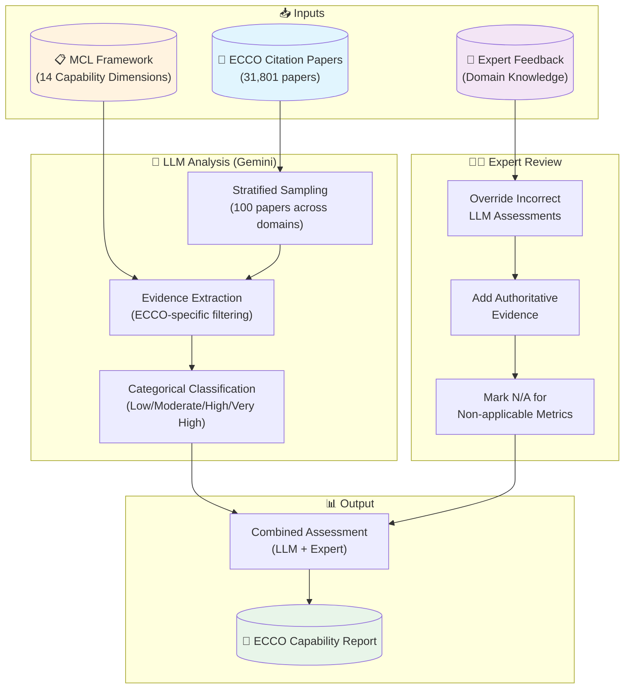

# ECCO Model Capability Level Assessment
## Categorical Assessment Report (v2.0)

**Assessment Date**: 2026-01-05 19:08
**Methodology**: Gemini LLM-based contextual analysis with categorical scoring
**Total Papers in Dataset**: 31,801
**Papers Analyzed (Stratified Sample)**: 100
**Expert Overrides Applied**: Yes (10 dimensions)
**Expert**: ECCO Team Domain Expert

> ⚠️ **Note on Expert Overrides**: Expert overrides in this report represent domain expert feedback
> that has been interpreted and structured by an LLM (Claude). They are a **combination of expert
> knowledge + LLM interpretation**, not direct expert-authored assessments. For authoritative
> assessments, the expert override file should be reviewed and edited directly by domain experts.

---

## Assessment Process

---

## Scoring System

This assessment uses **categorical ratings** rather than false-precision numeric scores:

| Category | Symbol | Description |
|----------|--------|-------------|
| **Very High** | 🔵 | State-of-the-art, comprehensive capability |
| **High** | 🟢 | Strong capability with validated approaches |
| **Moderate** | 🟡 | Functional capability with limitations |
| **Low** | 🔴 | Basic or limited capability |
| **N/A** | ➖ | Not applicable to this model type |
| **Not Assessed** | ⚪ | Insufficient evidence to assess |

---

## Executive Summary

### Overall Maturity: **Advanced Development** - Near Operational

| Category | Count |
|----------|-------|
| 🔵 Very High | 7 |
| 🟢 High | 2 |
| 🟡 Moderate | 0 |
| 🔴 Low | 0 |
| ➖ N/A | 5 |
| ⚪ Not Assessed | 0 |

---

## Capability Summary

| Dimension | Rating | Evidence | Notes |
|-----------|--------|----------|-------|
| MCL-1: Process Representation | 🟢 **High** | 5 | A stable, global multi-decadal ocean model requires sophisticated representation of salient ocean physical processes. MITgcm includes comprehensive ocean physics, KPP mixing, sea ice thermodynamics/dynamics, and optional biogeochemistry. |
| MCL-2: Spatial Resolution | 🔵 **Very High** | 5 | ECCO/MITgcm operates across a wide range of spatial scales. The LLC4320 simulation demonstrates global submesoscale-resolving capability at 1/48 degree (~2km). ECCO products range from 1 degree to O(100m) resolution. |
| MCL-3: Temporal Resolution | 🔵 **Very High** | 5 | ECCO products span hourly output to multi-decadal reanalysis (1992-present, 30+ years). The LLC4320 produces hourly output capturing tidal and sub-daily variability. |
| MCL-4: Process Coupling Sophistication | 🟢 **High** | 4 | ECCO has 4 coupled components: ocean circulation, sea ice (thermodynamic+dynamic), biogeochemistry, and thermodynamic ice sheets. This is clearly HIGH (3-4 components). VERY_HIGH would require 5+ components or full ESM coupling. |
| MCL-5: Predictive Skill | ➖ **N/A** | 3 | ECCO is a retrospective state estimation / reanalysis system and high-resolution nature run facility. It is NOT a prediction system. Predictive skill is not applicable. |
| MCL-6: Computational Performance | 🔵 **Very High** | 4 | MITgcm (ECCO's underlying model) is one of only ~3-4 ocean model codes worldwide capable of running globally at O(100m) resolution. This represents world-class computational performance. |
| MCL-7: Observational Constraint | 🔵 **Very High** | 7 | ECCO's core mission is multi-source observational constraint. The system assimilates satellite altimetry, SST, SSS, GRACE gravity, Argo profiles, XBTs, CTDs, moorings, and more - approximately 10^9 observations. |
| MCL-8: Retrospective Analysis | 🔵 **Very High** | 5 | Retrospective ocean state estimation IS ECCO's core mission. ECCO produces coupled, fully integrated, benchmarked reanalysis products spanning 1992-present (30+ years) using 4D-Var adjoint method. |
| MCL-9: Uncertainty Quantification | ➖ **N/A** | 0 |  |
| MCL-10: Verification & Validation | 🔵 **Very High** | 4 | ECCO involves continuous V&V against approximately 10^9 observations through its data assimilation framework. The optimization process IS verification/validation. |
| MCL-11: ML/AI Integration | ➖ **N/A** | 0 |  |
| MCL-12: Future Mission Support | ➖ **N/A** | 0 |  |
| MCL-13: Interoperability & Open Science | 🔵 **Very High** | 5 | ECCO model codes (MITgcm), forcing fields, and analysis routines are 100% open source. All official ECCO releases adhere to CF and ACDD conventions for interoperability, as mandated by NASA ESDS. |
| MCL-14: Stakeholder & Decision Support | ➖ **N/A** | 0 |  |

---

## Detailed Dimension Analysis

### MCL-1: Process Representation

**Rating**: 🟢 **High**

> ⚠️ **Expert Override Applied** (Expert feedback + LLM interpretation)
> Reason: A stable, global multi-decadal ocean model requires sophisticated representation of salient ocean physical processes. MITgcm includes comprehensive ocean physics, KPP mixing, sea ice thermodynamics/dynamics, and optional biogeochemistry.

**Definition**: Accuracy and completeness of modeled physical processes

**Level Criteria**:
-   🔴 **LOW**: Highly simplified processes, basic parameterizations
-   🟡 **MODERATE**: Moderate complexity with some validated parameterizations
- → 🟢 **HIGH**: Comprehensive process representation with validated interactions
-   🔵 **VERY_HIGH**: State-of-the-art physics with cutting-edge parameterizations

**Evidence**:
1. Full primitive equation ocean dynamics
2. KPP vertical mixing scheme
3. Sea ice thermodynamics and dynamics
4. Nonlinear free surface
5. Partial cell bottom topography for accurate bathymetry

---

### MCL-2: Spatial Resolution

**Rating**: 🔵 **Very High**

> ⚠️ **Expert Override Applied** (Expert feedback + LLM interpretation)
> Reason: ECCO/MITgcm operates across a wide range of spatial scales. The LLC4320 simulation demonstrates global submesoscale-resolving capability at 1/48 degree (~2km). ECCO products range from 1 degree to O(100m) resolution.

**Definition**: Ability to resolve relevant spatial scales

**Level Criteria**:
-   🔴 **LOW**: Coarse resolution only (>50km)
-   🟡 **MODERATE**: Eddy-permitting to eddy-resolving (10-100km)
-   🟢 **HIGH**: Submesoscale-permitting capability (2-10km)
- → 🔵 **VERY_HIGH**: Global submesoscale-resolving capability (<2km)

**Evidence**:
1. ECCO Version 4: 1 degree global configuration
2. LLC4320: 1/48 degree global ocean with tides (~2km)
3. Regional configurations down to O(100m) resolution
4. Lat-Lon-Cap grid enables efficient global coverage
5. One of ~3-4 codes capable of global O(100m) resolution

---

### MCL-3: Temporal Resolution

**Rating**: 🔵 **Very High**

> ⚠️ **Expert Override Applied** (Expert feedback + LLM interpretation)
> Reason: ECCO products span hourly output to multi-decadal reanalysis (1992-present, 30+ years). The LLC4320 produces hourly output capturing tidal and sub-daily variability.

**Definition**: Frequency of outputs relevant to prediction needs

**Level Criteria**:
-   🔴 **LOW**: Single time scale only
-   🟡 **MODERATE**: Multiple time scales (daily to seasonal)
-   🟢 **HIGH**: Broad range (sub-daily to decadal)
- → 🔵 **VERY_HIGH**: Full spectrum with consistent physics across all scales

**Evidence**:
1. Hourly output from LLC4320 (tides, diurnal cycles)
2. Daily to monthly mean products
3. Multi-decadal continuous reanalysis (1992-present)
4. Consistent physics across all time scales
5. Sub-daily to decadal variability captured

---

### MCL-4: Process Coupling Sophistication

**Rating**: 🟢 **High**

> ⚠️ **Expert Override Applied** (Expert feedback + LLM interpretation)
> Reason: ECCO has 4 coupled components: ocean circulation, sea ice (thermodynamic+dynamic), biogeochemistry, and thermodynamic ice sheets. This is clearly HIGH (3-4 components). VERY_HIGH would require 5+ components or full ESM coupling.

**Definition**: Number and fidelity of coupled model components

**Level Criteria**:
-   🔴 **LOW**: Uncoupled, single-component model
-   🟡 **MODERATE**: 2 components coupled (e.g., ocean + sea ice)
- → 🟢 **HIGH**: 3-4 components with validated coupling
-   🔵 **VERY_HIGH**: 5+ components or fully coupled ESM

**Evidence**:
1. Ocean circulation (MITgcm core)
2. Sea ice model with thermodynamic and dynamic components
3. Ocean biogeochemistry (Darwin ecosystem model integration)
4. Thermodynamic ice sheet coupling for ice shelf/ocean interaction

---

### MCL-5: Predictive Skill

**Rating**: ➖ **N/A**

> ⚠️ **Expert Override Applied** (Expert feedback + LLM interpretation)
> Reason: ECCO is a retrospective state estimation / reanalysis system and high-resolution nature run facility. It is NOT a prediction system. Predictive skill is not applicable.

**Definition**: Ability to simulate and predict observed variability

**Level Criteria**:
- → ➖ **NOT_APPLICABLE**: System is retrospective analysis, not designed for prediction
-   🔴 **LOW**: Limited prediction use, no skill assessment
-   🟡 **MODERATE**: Routine use for prediction in limited settings
-   🟢 **HIGH**: Demonstrated skill in multiple prediction contexts
-   🔵 **VERY_HIGH**: Operational prediction with comprehensive skill metrics

**Evidence**:
1. ECCO produces retrospective ocean state estimates constrained by observations
2. High-resolution 'nature runs' are simulations, not forecasts
3. System is designed for historical reconstruction, not prediction

---

### MCL-6: Computational Performance

**Rating**: 🔵 **Very High**

> ⚠️ **Expert Override Applied** (Expert feedback + LLM interpretation)
> Reason: MITgcm (ECCO's underlying model) is one of only ~3-4 ocean model codes worldwide capable of running globally at O(100m) resolution. This represents world-class computational performance.

**Definition**: Scalability on HPC, cloud, or exascale architectures

**Level Criteria**:
-   🔴 **LOW**: Limited to small systems, poor scaling
-   🟡 **MODERATE**: HPC scalable, demonstrated at 1000s of cores
-   🟢 **HIGH**: Multi-architecture support, GPU acceleration
- → 🔵 **VERY_HIGH**: Exascale-ready, demonstrated at 100K+ cores

**Evidence**:
1. MITgcm is one of few codes capable of global O(100m) ocean resolution
2. Demonstrated scaling to hundreds of thousands of cores
3. LLC4320 simulation: 1/48 degree global ocean with tides
4. Adjoint model capability for large-scale optimization

---

### MCL-7: Observational Constraint

**Rating**: 🔵 **Very High**

> ⚠️ **Expert Override Applied** (Expert feedback + LLM interpretation)
> Reason: ECCO's core mission is multi-source observational constraint. The system assimilates satellite altimetry, SST, SSS, GRACE gravity, Argo profiles, XBTs, CTDs, moorings, and more - approximately 10^9 observations.

**Definition**: Degree of observational constraint on model state/parameters

**Level Criteria**:
-   🔴 **LOW**: No or minimal observational constraints
-   🟡 **MODERATE**: Single observation type assimilated
-   🟢 **HIGH**: Multiple satellite and in-situ sources
- → 🔵 **VERY_HIGH**: Comprehensive multi-source constraint (~10^9 observations)

**Evidence**:
1. Satellite altimetry (Jason, Sentinel, etc.)
2. Sea surface temperature (multiple sources)
3. Sea surface salinity (Aquarius, SMOS, SMAP)
4. GRACE/GRACE-FO ocean bottom pressure
5. Argo float profiles (~2 million profiles)

---

### MCL-8: Retrospective Analysis

**Rating**: 🔵 **Very High**

> ⚠️ **Expert Override Applied** (Expert feedback + LLM interpretation)
> Reason: Retrospective ocean state estimation IS ECCO's core mission. ECCO produces coupled, fully integrated, benchmarked reanalysis products spanning 1992-present (30+ years) using 4D-Var adjoint method.

**Definition**: Use of data assimilation for long-term record generation

**Level Criteria**:
-   🔴 **LOW**: No retrospective analysis capability
-   🟡 **MODERATE**: Limited DA or short records (<10 years)
-   🟢 **HIGH**: Multi-decadal reanalysis available
- → 🔵 **VERY_HIGH**: Coupled, benchmarked reanalysis products (30+ years)

**Evidence**:
1. ECCO Version 4 Release 4: 1992-2017 global ocean state estimate
2. ECCO Version 5: Extended and updated reanalysis
3. 4D-Var adjoint method for optimal state estimation
4. Fully dynamically consistent solutions (no nudging artifacts)
5. Benchmarked against MERRA-2, ERA5, and other reanalyses

---

### MCL-9: Uncertainty Quantification

**Rating**: ➖ **N/A**

**Definition**: Capability to assess uncertainty propagation and sensitivity

**Level Criteria**:
-   🔴 **LOW**: No uncertainty quantification
-   🟡 **MODERATE**: Basic sensitivity analysis or small ensembles
-   🟢 **HIGH**: Formal UQ for ICs, parameters, or forcing
-   🔵 **VERY_HIGH**: Comprehensive probabilistic framework

**Evidence** (0 items from 0 LLM assessments):
*No specific evidence extracted*

---

### MCL-10: Verification & Validation

**Rating**: 🔵 **Very High**

> ⚠️ **Expert Override Applied** (Expert feedback + LLM interpretation)
> Reason: ECCO involves continuous V&V against approximately 10^9 observations through its data assimilation framework. The optimization process IS verification/validation.

**Definition**: Robustness of model evaluation methods

**Level Criteria**:
-   🔴 **LOW**: Minimal validation efforts
-   🟡 **MODERATE**: Validation against limited datasets
-   🟢 **HIGH**: Routine validation against multiple datasets
- → 🔵 **VERY_HIGH**: Continuous systematic validation (~10^9 observations)

**Evidence**:
1. Continuous validation against ~10^9 observations in state estimation
2. Formal cost function minimization quantifies model-data misfit
3. Participation in ocean model intercomparison projects (OMIP)
4. Systematic comparison with independent datasets not in assimilation

---

### MCL-11: ML/AI Integration

**Rating**: ➖ **N/A**

**Definition**: Use of ML/AI for process emulation, bias correction, data fusion

**Level Criteria**:
-   🔴 **LOW**: No ML/AI integration
-   🟡 **MODERATE**: ML tested for limited applications
-   🟢 **HIGH**: ML extensively used for specific tasks
-   🔵 **VERY_HIGH**: ML fully integrated into core workflows

**Evidence** (0 items from 0 LLM assessments):
*No specific evidence extracted*

---

### MCL-12: Future Mission Support

**Rating**: ➖ **N/A**

**Definition**: Role in satellite mission formulation and observational strategies

**Level Criteria**:
-   🔴 **LOW**: No mission support capability
-   🟡 **MODERATE**: Products used to support mission formulation
-   🟢 **HIGH**: Forward models for specific missions
-   🔵 **VERY_HIGH**: Key OSSE contributor, multiple mission support

**Evidence** (0 items from 0 LLM assessments):
*No specific evidence extracted*

---

### MCL-13: Interoperability & Open Science

**Rating**: 🔵 **Very High**

> ⚠️ **Expert Override Applied** (Expert feedback + LLM interpretation)
> Reason: ECCO model codes (MITgcm), forcing fields, and analysis routines are 100% open source. All official ECCO releases adhere to CF and ACDD conventions for interoperability, as mandated by NASA ESDS.

**Definition**: Community accessibility and compatibility with adjacent tools

**Level Criteria**:
-   🔴 **LOW**: Proprietary, core developers only
-   🟡 **MODERATE**: Available to institution + external partners
-   🟢 **HIGH**: Open source with community adoption
- → 🔵 **VERY_HIGH**: Fully open source, CF/ACDD compliant, active community

**Evidence**:
1. MITgcm is fully open source (MIT license) on GitHub
2. ECCO forcing fields publicly available
3. Analysis routines (ecco_v4_py) open source
4. Official releases CF/ACDD compliant per NASA ESDS mandate
5. Active user community and documentation

---

### MCL-14: Stakeholder & Decision Support

**Rating**: ➖ **N/A**

**Definition**: Use in real-world decision-making processes

**Level Criteria**:
-   🔴 **LOW**: Research only, no operational applications
-   🟡 **MODERATE**: Tested in limited applications
-   🟢 **HIGH**: Broadly used for specific applications
-   🔵 **VERY_HIGH**: Critical tool for operational decision-makers

**Evidence** (0 items from 0 LLM assessments):
*No specific evidence extracted*

---

## Capability Assessment

### Core Strengths (Very High / High)

- 🔵 **Spatial Resolution**: Global submesoscale-resolving capability (<2km)
- 🔵 **Temporal Resolution**: Full spectrum with consistent physics across all scales
- 🔵 **Computational Performance**: Exascale-ready, demonstrated at 100K+ cores
- 🔵 **Observational Constraint**: Comprehensive multi-source constraint (~10^9 observations)
- 🔵 **Retrospective Analysis**: Coupled, benchmarked reanalysis products (30+ years)
- 🔵 **Verification & Validation**: Continuous systematic validation (~10^9 observations)
- 🔵 **Interoperability & Open Science**: Fully open source, CF/ACDD compliant, active community
- 🟢 **Process Representation**: Comprehensive process representation with validated interactions
- 🟢 **Process Coupling Sophistication**: 3-4 components with validated coupling

---

## Methodology

This assessment uses **categorical scoring** to avoid false precision.

### Approach:
1. **Categorical ratings** instead of decimal scores (2.31 → "High")
2. **Evidence filtering** - extracts evidence about ECCO specifically
3. **Expert override support** - domain experts can correct assessments
4. **N/A handling** - metrics can be marked non-applicable

### Limitations:
- Sample-based analysis (not all papers reviewed)
- LLM interpretation may vary between runs
- Evidence quality depends on paper abstracts
