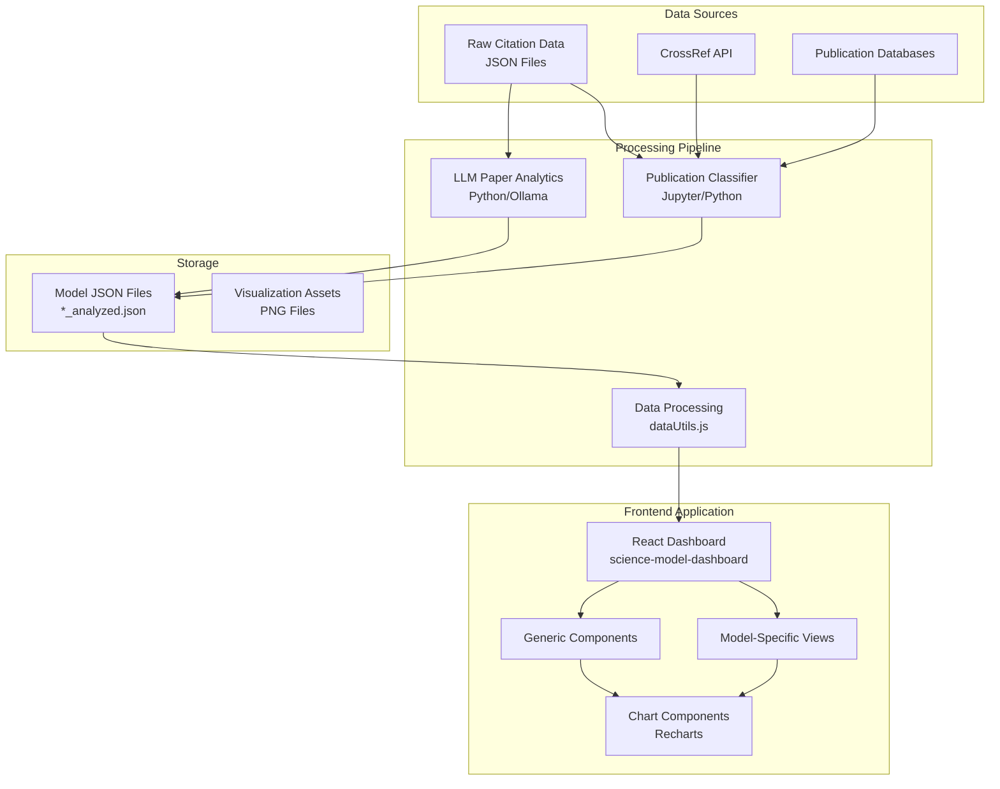
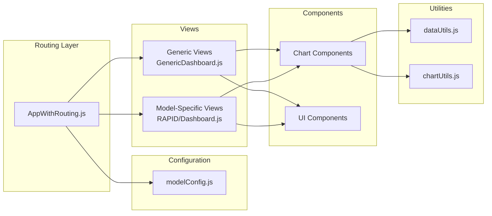
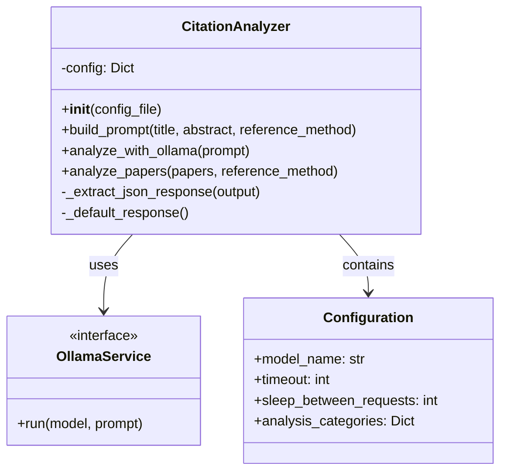
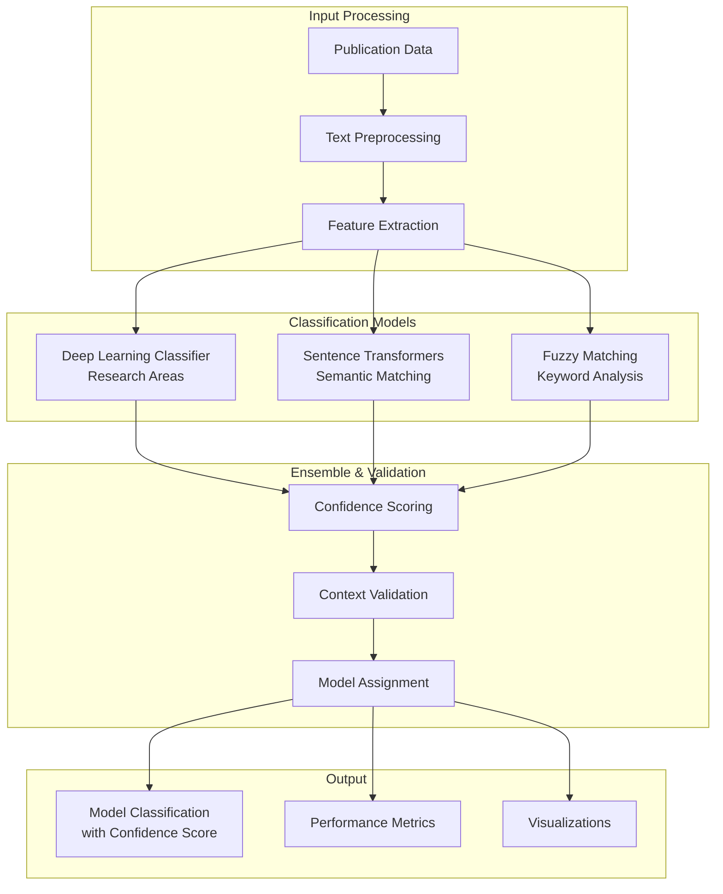
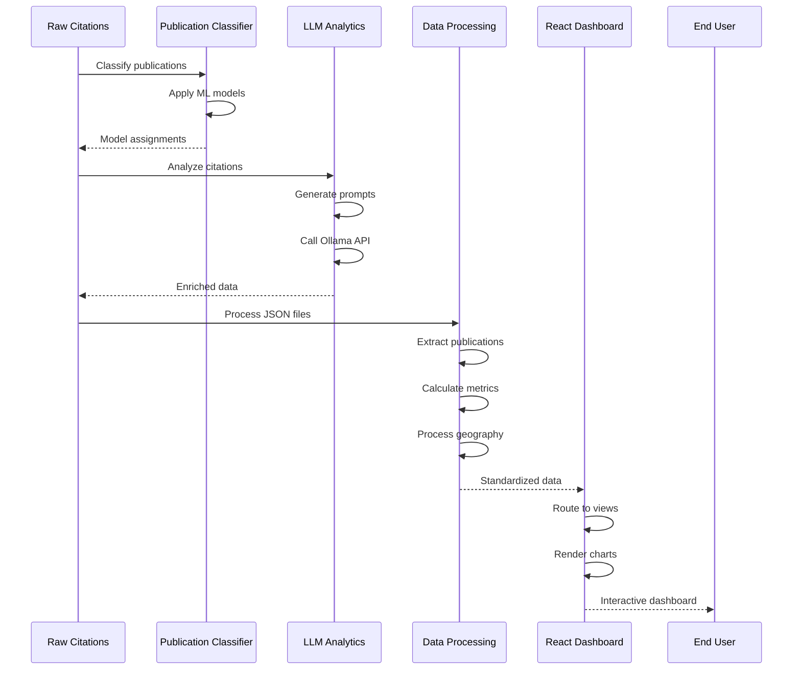
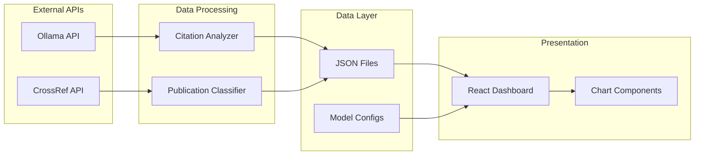
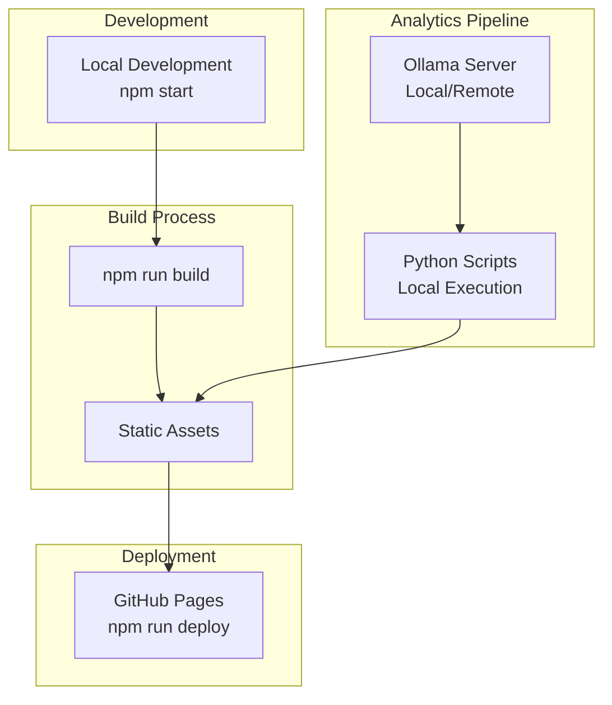

# JPL's Earth Modeling Enterprise (JEME) Publication Dashboard - How It Works 

## Summary

The JPL's Earth Modeling Enterprise (JEME) Publication Dashboard is a multi-component system designed for analyzing and visualizing scientific citation data across six NASA models: RAPID, CARDAMOM, CMS-Flux, ECCO, ISSM, and MOMO-CHEM. The system comprises three integrated components: a React-based web dashboard for visualization, an LLM-powered citation analyzer using Ollama, and a machine learning publication classifier using deep learning techniques.

## System Architecture Overview



## Component Deep Dive

### 1. JPL's Earth Modeling Enterprise (JEME) Publication Dashboard (React Application)

#### Architecture Pattern
The dashboard implements a **hybrid architecture** combining generic and model-specific components:



#### Key Features
- **Multi-Model Support**: Centralized configuration system in `modelConfig.js`
- **Dynamic Routing**: URL-based navigation with model-specific and generic routes
- **Data Processing Pipeline**: Standardized data extraction and transformation
- **Responsive Design**: Tailwind CSS with mobile-first approach
- **Interactive Visualizations**: Recharts-based charts with dynamic updates

#### Model Configuration System
Each model is configured with:
- Display name and description
- Data path to JSON file
- Color theme
- Research domain
- GitHub and website links

#### Routing Architecture
```
/science-model-dashboard                     → Main dashboard
/science-model-dashboard/{modelName}         → Model dashboard
/science-model-dashboard/{modelName}/citations → Citations page
/science-model-dashboard/{modelName}/geographic-impact → Geographic analysis
/science-model-dashboard/{modelName}/research-domains → Domain analysis
```

### 2. LLM Paper Analytics

#### System Architecture



#### Key Features
- **Flexible Configuration**: Customizable analysis categories and engagement levels
- **Multiple LLM Support**: Works with any Ollama-compatible model
- **Robust Error Handling**: Graceful fallbacks for failed analyses
- **Batch Processing**: Sequential processing with rate limiting
- **Paper Classification**: 
    - Engagement levels (1-4)
    - Research domains
    - Geographic regions
    - Country identification

#### Engagement Level Classification

1. **Level 1**: Acknowledgement Citation
   - The work is mentioned only as background or context (e.g., in the introduction or related work) without using its data, methods, or results.
   - Example: "We build on prior work in X [Author, Year]."

2. **Level 2**: Data/Method Usage
   - The work's data, tools, or methods are applied as-is without modification. The citing paper relies on the resource to support its own results.
   - Example: Using a dataset or off-the-shelf model from the cited work.

3. **Level 3**: Model/Method Adaptation
   - The work's approach, data, or model is adapted, modified, or improved for new purposes. The citing paper adds innovation while leveraging the foundation.
   - Example: Altering an algorithm for a new domain, fine-tuning a model, or combining methods from multiple sources.

4. **Level 4**: Foundational Method
   - The cited work provides a conceptual or methodological foundation that is central to the citing research. Without it, the work would not exist in its current form.
   - Example: A theory, framework, or algorithm that becomes the main driver of the new research.

### 3. Publication Classifier

#### Machine Learning Architecture



#### Key Features
- **Multi-Model Classification**: Assigns publications to appropriate NASA models
- **Deep Learning Models**: For research area and keyword classification
- **Semantic Understanding**: Sentence transformers for context matching
- **Fuzzy Matching**: Flexible keyword matching with context validation
- **Performance Analysis**: Comprehensive metrics including F1, MCC, calibration
- **Visualization Suite**: 16+ different metric visualizations

#### Supported Models
- **ECCO**: Ocean circulation and climate
- **RAPID**: River discharge computation
- **ISSM**: Ice sheet modeling
- **CMS-Flux**: Carbon monitoring
- **CARDAMOM**: Carbon cycle framework
- **MOMO-CHEM**: Atmospheric chemistry

## Data Flow Pipeline



## Technical Stack

### Frontend
- **Framework**: React 18.x
- **Routing**: React Router v6
- **Styling**: Tailwind CSS
- **Charts**: Recharts
- **Icons**: Lucide React
- **Build**: Create React App
- **Deployment**: GitHub Pages

### Backend Processing
- **Language**: Python 3.7+
- **LLM Integration**: Ollama
- **ML Libraries**: PyTorch, Transformers, scikit-learn
- **NLP**: spaCy, SentenceTransformers
- **Data Processing**: pandas, numpy
- **Fuzzy Matching**: RapidFuzz

### Data Storage
- **Format**: JSON files
- **Structure**: Standardized citation objects
- **Naming**: `{MODEL_NAME}_analyzed.json`

## Key Design Patterns

### 1. Configuration-Driven Development
- Centralized model configuration
- Flexible analysis categories
- Dynamic route generation

### 2. Component Composition
- Generic base components
- Model-specific overrides
- Shared chart components

### 3. Data Standardization
- Common extraction functions
- Unified data structure
- Consistent field naming

### 4. Error Resilience
- Graceful degradation
- Default fallbacks
- Comprehensive error handling

## System Integration Points



## Performance Characteristics

### Dashboard Performance
- **Initial Load**: ~2-3 seconds
- **Route Changes**: <500ms
- **Chart Updates**: Real-time
- **Data Processing**: Client-side, optimized

### LLM Analytics Performance
- **Per Paper**: 1-5 minutes (model dependent)
- **Batch Size**: Sequential processing
- **Timeout**: Configurable (default 600s)
- **Rate Limiting**: 1 second between requests

### Classifier Performance
- **Accuracy**: Model-specific F1 scores (0.xx-0.yy)
- **Processing Speed**: ~100 papers/minute
- **Memory Usage**: <2GB for full pipeline

## Deployment Architecture



## Security Considerations

1. **Data Privacy**: All processing happens locally
2. **API Security**: No sensitive data in client code
3. **Input Validation**: Sanitized user inputs
4. **Error Messages**: No sensitive information exposed
5. **Dependencies**: Regular security updates

## Scalability Considerations

### Current Limitations
- Sequential LLM processing
- Client-side data processing
- Static file storage

### Scaling Opportunities
1. **Parallel Processing**: Implement concurrent LLM calls
2. **Server-Side Processing**: Move heavy computations to backend
3. **Database Integration**: Replace JSON files with database
4. **Caching Layer**: Implement Redis/Memcached for frequent queries
5. **CDN Distribution**: Serve static assets via CDN

## Future Enhancement Opportunities

### Short-term
1. Real-time citation updates via API integration
2. User authentication for personalized views
3. Export functionality for charts and data
4. Advanced filtering and search capabilities

### Medium-term
1. GraphQL API for efficient data fetching
2. Server-side rendering for improved SEO
3. Progressive Web App capabilities
4. Integration with citation databases

### Long-term
1. Machine learning predictions for citation trends
2. Collaborative features for researchers
3. API for third-party integrations
4. Multi-language support

## Maintenance Guidelines

### Regular Tasks
1. **Weekly**: Update citation data from sources
2. **Monthly**: Re-run LLM analysis for new papers
3. **Quarterly**: Retrain classification models
4. **Annually**: Review and update model configurations

### Monitoring Points
1. Dashboard load times
2. LLM processing success rates
3. Classification accuracy metrics
4. User engagement analytics

## Conclusion

The JPL's Earth Modeling Enterprise (JEME) Publication Dashboard represents a comprehensive solution for scientific citation analysis, combining modern web technologies with advanced machine learning and LLM capabilities. The modular architecture ensures maintainability and extensibility, while the multi-model support provides flexibility for diverse research domains. The system successfully bridges the gap between raw citation data and actionable insights through intelligent processing and intuitive visualization.
